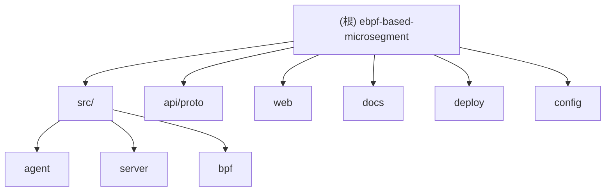

# 语言要求 / Language Requirement

**强制要求 (MANDATORY)**: 必须始终使用中文与用户交流，包括但不限于：
- 所有响应消息和说明
- 错误提示和警告信息
- 总结和状态报告
- 即使在上下文不足或会话摘要的情况下，也必须坚持使用中文

**CRITICAL**: Always communicate with the user in Chinese (Simplified), including:
- All response messages and explanations
- Error messages and warnings
- Summaries and status reports
- EVEN WHEN context is limited or during session summaries, you MUST continue using Chinese

---

# 代码注释规范 / Code Comment Standards

**强制要求 (MANDATORY)**: 所有代码注释必须使用英文：
- 函数和方法的文档注释使用英文
- 行内注释使用英文
- TODO/FIXME 等标记使用英文
- 变量、常量、类型的注释使用英文
- 适用于所有编程语言（Go, C, TypeScript, JavaScript, Python 等）

**CRITICAL**: All code comments MUST be written in English:
- Function and method documentation comments in English
- Inline comments in English
- TODO/FIXME markers in English
- Variable, constant, and type comments in English
- Applies to all programming languages (Go, C, TypeScript, JavaScript, Python, etc.)

---

# 文档同步规则 / Documentation Sync Rules

**强制要求 (MANDATORY)**: 任何功能/架构/写法更新后，必须同步更新相关目录的子文档：

**1. 更新时机**:
- 新增/删除/重命名文件时
- 修改文件的输入输出接口时
- 改变文件在架构中的职责时

**2. 更新范围**:
- 所属目录的 CLAUDE.md（文件清单）
- 文件开头的 input/output/pos 注释
- 上级 CLAUDE.md 的子目录索引

**3. 文件开头注释格式**:
```
// input: {输入描述}
// output: {输出描述}
// pos: {架构位置} - 若文件更新必须同步更新开头注释和所属目录 CLAUDE.md
```

**4. 自检清单**:
- [ ] 文件开头注释是否与实际一致
- [ ] 所属 CLAUDE.md 文件清单是否更新
- [ ] 模块级 CLAUDE.md 是否需要更新

---

<!-- OPENSPEC:START -->
# OpenSpec Instructions

These instructions are for AI assistants working in this project.

Always open `@/openspec/AGENTS.md` when the request:
- Mentions planning or proposals (words like proposal, spec, change, plan)
- Introduces new capabilities, breaking changes, architecture shifts, or big performance/security work
- Sounds ambiguous and you need the authoritative spec before coding

Use `@/openspec/AGENTS.md` to learn:
- How to create and apply change proposals
- Spec format and conventions
- Project structure and guidelines

Keep this managed block so 'openspec update' can refresh the instructions.

<!-- OPENSPEC:END -->

---

# Git Repository Instructions

**IMPORTANT**: Do NOT automatically push commits to GitHub repository. Only create local commits. The user will manually push changes to the remote repository when ready.

**Commit Message Format**:
- Do NOT add emoji markers (like 🤖) to commit messages
- Do NOT add "Generated with Claude Code" footer
- Do NOT add "Co-Authored-By: Claude" footer
- Keep commit messages clean and professional
- Use conventional commit format when appropriate

---

# 项目愿景

基于 eBPF 的高性能网络微隔离系统，旨在为容器/虚拟机环境提供内核级的细粒度网络访问控制，实现亚微秒级数据包处理延迟，支持 10 万+ 并发会话。

## 核心特性

- **极致性能**: 热路径 <1μs, 冷路径 5-20μs
- **会话跟踪**: 基于 LRU 的连接跟踪，支持 10 万并发会话
- **多层策略**: 精确匹配 + 通配符（CIDR/端口范围）+ 默认策略
- **无锁统计**: 基于 Per-CPU 的计数器，零 CPU 竞争
- **实时事件**: 通过 Ring Buffer 上报流事件（新连接、拒绝）
- **RESTful API**: 完整的策略 CRUD 操作
- **gRPC 通信**: Agent-Server 基于 Protocol Buffers 的高效通信
- **TCP 状态机**: 连接状态跟踪，实现有状态过滤

---

# 架构总览

## 系统架构图

```
┌─────────────────────────────────────────────────────────────────┐
│                   用户 / 外部系统                                  │
│              (Web UI / API / Orchestrators)                      │
└────────────────────────────┬────────────────────────────────────┘
                             │ HTTP/gRPC
┌────────────────────────────▼────────────────────────────────────┐
│                  控制平面 (User Space)                            │
│  ┌──────────────┐  ┌──────────────┐  ┌──────────────────────┐  │
│  │    Server    │  │    Agent     │  │   Policy Manager     │  │
│  │  (gRPC API)  │◄─┤  (eBPF Mgr)  │──┤   + DataPlane Mgr    │  │
│  └──────────────┘  └──────────────┘  └──────────────────────┘  │
└────────────────────────────┬────────────────────────────────────┘
                             │ Cilium eBPF Library
┌────────────────────────────▼────────────────────────────────────┐
│                   数据平面 (Kernel Space)                         │
│  ┌──────────────────────────────────────────────────────────┐   │
│  │  TC eBPF Program                                         │   │
│  │  • 报文解析 (5-tuple)  • 会话跟踪 (LRU)                    │   │
│  │  • 策略匹配 (Hash)     • 统计数据 (Per-CPU)                │   │
│  └──────────────────────────────────────────────────────────┘   │
│  ┌──────────────────────────────────────────────────────────┐   │
│  │  eBPF Maps: session_map | policy_map | stats_map | ...   │   │
│  └──────────────────────────────────────────────────────────┘   │
└─────────────────────────────────────────────────────────────────┘
```

## 数据流

```
Packet → TC Ingress Hook → eBPF Program → Policy Check → Session Tracking → Action (PASS/DROP)
```

---

# 模块结构图 (Mermaid)



---

# 模块索引

| 模块路径 | 语言 | 职责 | 入口文件 | 文档 |
|---------|------|------|---------|------|
| **src/agent** | Go | eBPF 数据平面管理、策略执行、本地 API 服务 | `cmd/main.go` | [Agent CLAUDE.md](./src/agent/CLAUDE.md) |
| **src/server** | Go | 中心化策略服务器、gRPC API、数据聚合 | `cmd/main.go` | [Server CLAUDE.md](./src/server/CLAUDE.md) |
| **src/bpf** | C | eBPF 内核程序（TC/XDP）、数据包过滤 | `tc_microsegment.bpf.c` | [BPF CLAUDE.md](./src/bpf/CLAUDE.md) |
| **api/proto** | Protobuf | gRPC 协议定义（Policy/Flow/Agent） | `policy/policy.proto` | [Proto CLAUDE.md](./api/proto/CLAUDE.md) |
| **web** | TypeScript/React | 管理界面、可视化、拓扑图 | `src/main.tsx` | [Web CLAUDE.md](./web/CLAUDE.md) |
| **deploy** | YAML | Kubernetes/Systemd 部署配置 | - | - |
| **docs** | Markdown | 设计文档、学习指南、架构分析 | - | - |

---

# 运行与开发

## 快速启动

### 前置条件

- Linux Kernel 6.x+ (支持 eBPF)
- Go 1.21+
- Clang/LLVM (用于 eBPF 编译)
- PostgreSQL 14+ (用于 Server)
- Node.js 18+ (用于 Web UI)

### 一键启动

```bash
# 启动所有组件 (PostgreSQL + Server + Agent + Web UI)
./start-all.sh

# 访问 Web UI: http://localhost:3000
# API 地址: http://localhost:8080
```

### 分步启动

```bash
# 1. 编译所有组件
make all

# 2. 启动 Server
./bin/microsegment-server --config config/server.yaml

# 3. 启动 Agent (需要 root 权限)
sudo ./bin/microsegment-agent --config config/agent.yaml

# 4. 启动 Web UI
cd web && npm run dev
```

## 构建配置

### 预定义构建模式

```bash
# 生产构建（所有特性启用，无调试）
make build-production

# 调试构建（启用 eBPF 调试日志）
make build-debug

# 最小构建（无分片处理、无 NAT）
make build-minimal

# 查看当前配置
make show-config
```

### eBPF 特性标志

| 标志 | 描述 | 默认值 |
|-----|------|--------|
| `DEBUG_MODE` | 启用 eBPF 调试日志 | 0 |
| `ENABLE_IP_FRAGMENT_HANDLING` | 处理 IP 分片 | 1 |
| `ENABLE_NAT_SUPPORT` | NAT 检测支持 | 1 |

---

# 测试策略

## 单元测试

```bash
# 运行所有单元测试
make test

# 运行特定模块测试
cd src/agent && go test -v ./pkg/dataplane/...
```

## E2E 测试

```bash
# 运行集成测试（需要 root）
sudo make test-integration

# Agent E2E 测试
cd src/agent && go test -v ./test/e2e/...
```

## 性能测试

```bash
# 吞吐量测试（iperf3）
./tests/performance/benchmark_test.sh

# 延迟测试
ping -c 100 <target_ip>
```

---

# 编码规范

## Go 代码规范

- **包命名**: 简短、小写、单数（`policy`, `workload`, `groups`）
- **结构体**: 大驼峰（`PolicyManager`, `WorkloadStorage`）
- **接口**: 大驼峰，通常以 -er 结尾（`Storage`, `Manager`）
- **函数/方法**: 公开大驼峰，私有小驼峰（`AddPolicy()`, `validateRule()`）
- **文件命名**: `snake_case.go`（如 `policy_manager.go`, `storage_test.go`）
- **错误处理**: 始终检查 `error`，使用 `fmt.Errorf("context: %w", err)` 包装

## eBPF 代码规范

- **文件命名**: `*.bpf.c` 用于 eBPF 代码
- **Maps**: `policy_map`, `session_map`, `stats_map`（snake_case）
- **Structs**: `struct policy_key`, `struct tcp_state`（snake_case）
- **Functions**: `track_session()`, `match_policy()`（snake_case，动词引导）
- **边界检查**: 始终包含 `if ((void *)(hdr + 1) > data_end)`
- **内联函数**: 优先使用 `__always_inline` 实现代码复用

## TypeScript 代码规范

- **组件命名**: 大驼峰（`PolicyTable`, `FlowChart`）
- **Hooks**: 小驼峰，以 `use` 开头（`usePolicies`, `useFlows`）
- **类型定义**: 大驼峰（`Policy`, `Flow`, `Agent`）
- **常量**: UPPER_CASE（`API_BASE_URL`, `DEFAULT_PAGE_SIZE`）

---

# AI 使用指引

## 代码修改原则

1. **仅修改现有文件**: 优先编辑现有代码，避免创建新文件
2. **保持架构一致**: 遵循现有三层架构（API → Manager → Storage）
3. **测试驱动**: 修改代码后必须更新或添加测试
4. **性能优先**: eBPF 代码必须考虑验证器限制和性能影响

## 常见任务参考

### 添加新策略规则

1. 更新 `api/proto/policy/policy.proto`
2. 重新生成 Proto 代码：`make proto`
3. 修改 `src/bpf/tc_microsegment.bpf.c` 中的匹配逻辑
4. 重新生成 eBPF：`make bpf`
5. 更新 Agent Policy Manager：`src/agent/pkg/policy/storage.go`
6. 添加 E2E 测试：`src/agent/test/e2e/*_test.go`

### 添加新 API 端点

1. 定义 API 模型：`src/server/pkg/api/handlers/*.go`
2. 实现处理器函数
3. 注册路由（在 `cmd/main.go` 的 HTTP server 初始化部分）
4. 添加单元测试：`*_test.go`

### 修改 Web UI

1. 更新类型定义：`web/src/types/*.ts`
2. 修改 API 客户端：`web/src/api/*.ts`
3. 更新组件：`web/src/components/**/*.tsx`
4. 添加 Hooks（如需要）：`web/src/hooks/*.ts`
5. 运行格式化：`cd web && npm run format`

---

# 变更记录 (Changelog)

## [初始化] - 2025-11-27 00:02:00

- 创建根级和模块级 CLAUDE.md 文档
- 记录当前项目结构、架构、模块划分
- 定义编码规范和 AI 使用指引
- 扫描覆盖率：
  - 根模块：100%（Makefile, go.mod, README.md, 配置文件）
  - Agent 模块：100%（pkg/下所有子包，test/e2e/）
  - Server 模块：100%（pkg/下所有子包，tests/）
  - BPF 模块：100%（tc_microsegment.bpf.c, headers/）
  - Proto 模块：100%（common, policy, flow, agent, alert）
  - Web 模块：100%（components, pages, hooks, api, types）

---

**最后更新时间**: 2025-11-27 00:02:00
**扫描工具**: Claude Code 初始化架构师
**覆盖率**: 全仓扫描完成（6 个核心模块 + 文档目录）
**总文件数**: 约 1200+ 文件（含 node_modules, source-references, libbpf, bpftool）
**核心业务代码**: 约 300+ 文件（Go, C, TypeScript, Proto）
