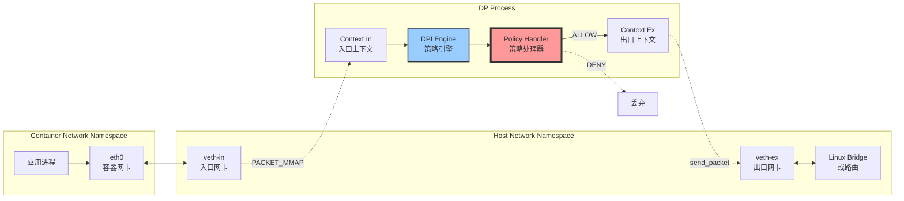
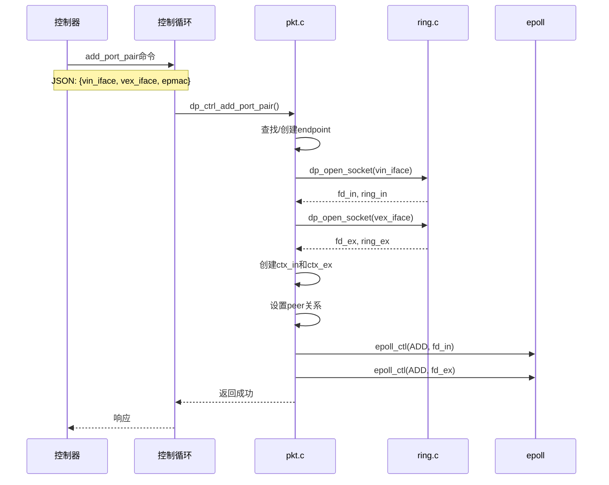
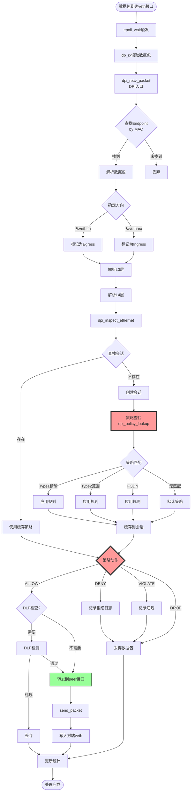
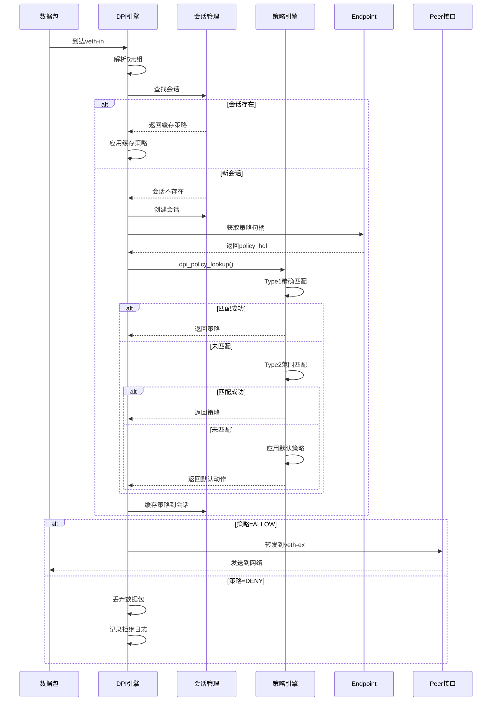
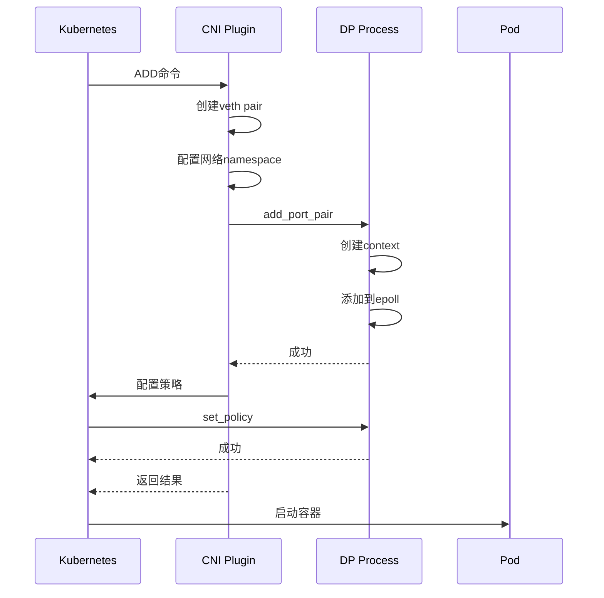

# TC模式微隔离详细设计文档

## 1. TC模式概述

TC（Traffic Control）模式是DP数据平面实现微隔离的核心工作模式之一。在此模式下，DP进程完全控制容器的网络流量，通过veth pair（虚拟网卡对）实现数据包的拦截、检测和转发，从而实现**强制性的微隔离策略执行**。

### 1.1 核心特点

- **In-line部署**：位于流量路径中，所有数据包必须经过DP进程
- **强制执行**：可以丢弃、修改或重定向数据包
- **双向控制**：同时控制入站和出站流量
- **零信任架构**：默认拒绝，显式允许

### 1.2 与其他模式对比

| 特性 | TC模式 | TAP模式 | NFQ模式 |
|------|--------|---------|---------|
| 部署方式 | In-line | 旁路 | In-line |
| 流量控制 | 完全控制 | 只读监控 | 完全控制 |
| 性能影响 | 中等 | 最小 | 较大 |
| 策略执行 | 强制 | 仅检测 | 强制 |
| 适用场景 | 生产微隔离 | 审计可见性 | CNI集成 |

---

## 2. 网络拓扑架构

### 2.1 基本拓扑



### 2.2 数据包流向

#### 出站流量（Egress）
```
容器应用 → eth0 → veth-in → DP进程(策略检查) → veth-ex → 主机网络
```

#### 入站流量（Ingress）
```
主机网络 → veth-ex → DP进程(策略检查) → veth-in → eth0 → 容器应用
```

---

## 3. 实现原理

### 3.1 Port Pair机制

TC模式的核心是**Port Pair**（端口对）机制：

```c
// 数据结构关系
typedef struct dp_context_ {
    char name[IFACE_NAME_LEN];      // 接口名称
    struct dp_context_ *peer;        // 指向对端context
    io_mac_t *ep_mac;                // 关联的endpoint MAC
    dp_ring_t *ring;                 // PACKET_MMAP环形缓冲区
    int fd;                          // socket文件描述符
    bool tap;                        // false表示TC模式
} dp_context_t;

// Port Pair配置
ctx_in->peer = ctx_ex;   // 入口指向出口
ctx_ex->peer = ctx_in;   // 出口指向入口
ctx_in->tap = false;     // TC模式
ctx_ex->tap = false;
```

### 3.2 接口创建流程



### 3.3 关键代码分析

#### 添加Port Pair
```c
// pkt.c: dp_data_add_port_pair()
static int dp_data_add_port_pair(dp_thread_data_t *data, 
                                  const char *vin_iface,
                                  const char *vex_iface,
                                  uint8_t *epmac, bool quar)
{
    io_mac_t *mac;
    dp_context_t *ctx_in, *ctx_ex;
    
    // 1. 查找或创建endpoint
    mac = ep_mac_lookup_create(epmac);
    
    // 2. 打开入口接口
    ctx_in = dp_open_socket(data, vin_iface, mac, false);
    if (!ctx_in) return -1;
    
    // 3. 打开出口接口
    ctx_ex = dp_open_socket(data, vex_iface, mac, false);
    if (!ctx_ex) {
        dp_close_socket(ctx_in);
        return -1;
    }
    
    // 4. 建立peer关系（关键！）
    ctx_in->peer = ctx_ex;
    ctx_ex->peer = ctx_in;
    
    // 5. 设置TC模式标志
    ctx_in->tap = false;
    ctx_ex->tap = false;
    
    // 6. 添加到epoll监听
    dp_add_to_epoll(data, ctx_in);
    dp_add_to_epoll(data, ctx_ex);
    
    return 0;
}
```

---

## 4. 数据包处理流程

### 4.1 完整处理流程图



### 4.2 关键代码路径

#### 数据包接收
```c
// pkt.c: dp_data_thr()
void *dp_data_thr(void *args)
{
    dp_thread_data_t *data = (dp_thread_data_t *)args;
    
    while (g_running) {
        // epoll等待事件
        int nfds = epoll_wait(data->epoll_fd, events, MAX_EVENTS, timeout);
        
        for (int i = 0; i < nfds; i++) {
            dp_context_t *ctx = (dp_context_t *)events[i].data.ptr;
            
            // 读取数据包
            dp_rx(ctx);
        }
    }
}

// 读取数据包
static void dp_rx(dp_context_t *ctx)
{
    uint8_t *pkt;
    uint32_t len;
    
    // 从PACKET_MMAP环形缓冲区读取
    while (dp_ring_rx(ctx->ring, &pkt, &len) == 0) {
        // 调用DPI处理
        dpi_recv_packet(ctx, pkt, len);
    }
}
```

#### 策略执行和转发
```c
// dpi/dpi_entry.c: dpi_recv_packet()
int dpi_recv_packet(dp_context_t *ctx, uint8_t *pkt, uint32_t len)
{
    // ... 解析和策略检查 ...
    
    action = dpi_inspect_ethernet(&th_packet);
    
    // 根据action决定转发或丢弃
    if (likely(!tap && action != DPI_ACTION_DROP && 
               action != DPI_ACTION_RESET &&
               action != DPI_ACTION_BLOCK)) {
        // 允许：转发到peer接口
        if (th_packet.frag_trac != NULL) {
            dpi_frag_send(th_packet.frag_trac, ctx);
        } else {
            // 关键：发送到对端接口
            g_io_callback->send_packet(ctx, pkt, len);
        }
    } else {
        // 拒绝：丢弃数据包
        if (th_packet.frag_trac != NULL) {
            dpi_frag_discard(th_packet.frag_trac);
        }
        // TC模式下，不转发即实现阻断
        return 1; // 返回1表示丢弃
    }
    
    return 0;
}
```

#### 发送到peer接口
```c
// ring.c: dp_tx_send_packet()
void dp_tx_send_packet(dp_context_t *ctx, uint8_t *pkt, int len)
{
    dp_context_t *peer = ctx->peer;
    
    if (peer && peer->ring) {
        // 写入peer的PACKET_MMAP缓冲区
        dp_ring_tx(peer->ring, pkt, len);
    }
}
```

---

## 5. 策略配置与执行

### 5.1 策略配置示例

#### 场景1：允许特定服务访问
```json
{
    "command": "set_policy",
    "macs": ["02:42:ac:11:00:02"],
    "def_action": 2,
    "apply_dir": 0,
    "rules": [
        {
            "id": 1001,
            "sip": "192.168.1.10",
            "dip": "192.168.1.20",
            "dport": 80,
            "proto": 6,
            "action": 1,
            "ingress": false
        },
        {
            "id": 1002,
            "sip": "192.168.1.20",
            "dip": "192.168.1.10",
            "sport": 80,
            "proto": 6,
            "action": 1,
            "ingress": true
        }
    ]
}
```

**说明**：
- 允许192.168.1.10访问192.168.1.20的80端口（HTTP）
- 允许返回流量
- 默认拒绝其他所有流量

#### 场景2：网段级别访问控制
```json
{
    "command": "set_policy",
    "macs": ["02:42:ac:11:00:03"],
    "def_action": 2,
    "rules": [
        {
            "id": 2001,
            "sip": "10.0.1.0",
            "sip_r": "10.0.1.255",
            "dip": "10.0.2.0",
            "dip_r": "10.0.2.255",
            "dport": 443,
            "proto": 6,
            "action": 1
        }
    ]
}
```

**说明**：
- 允许10.0.1.0/24网段访问10.0.2.0/24网段的443端口
- 使用Type2范围匹配规则

### 5.2 策略执行流程



---

## 6. 性能优化

### 6.1 零拷贝技术

**PACKET_MMAP机制**：
```c
// ring.c中的实现
struct tpacket_req3 req = {
    .tp_block_size = 4096 * 256,    // 1MB块
    .tp_block_nr = 64,               // 64个块
    .tp_frame_size = 2048,           // 2KB帧
    .tp_frame_nr = 32768,            // 总帧数
    .tp_retire_blk_tov = 60,         // 超时60ms
    .tp_feature_req_word = TP_FT_REQ_FILL_RXHASH,
};

// mmap映射到用户态
void *ring = mmap(NULL, req.tp_block_size * req.tp_block_nr,
                  PROT_READ | PROT_WRITE, MAP_SHARED, fd, 0);
```

**优势**：
- 避免内核-用户态数据拷贝
- 批量处理数据包
- 降低系统调用开销

### 6.2 策略缓存

**会话级缓存**：
```c
typedef struct dpi_session_ {
    // ...
    dpi_policy_desc_t policy_desc;  // 缓存的策略
    uint16_t policy_ver;             // 策略版本
    // ...
} dpi_session_t;

// 首次查找后缓存
session->policy_desc = *desc;
session->policy_ver = ep->policy_ver;

// 后续数据包直接使用
if (session->policy_ver == ep->policy_ver) {
    // 使用缓存策略
    action = session->policy_desc.action;
} else {
    // 重新查找（策略已更新）
    dpi_policy_lookup(...);
}
```

**效果**：
- 首包查找：~1000ns
- 后续包缓存：~100ns
- 性能提升10倍

### 6.3 多线程处理

**线程分配策略**：
```c
// 每个DP线程处理一组接口
dp_thread_data_t threads[MAX_DP_THREADS];

// 接口分配到线程（轮询）
int thread_id = interface_id % num_threads;
dp_data_add_port_pair(&threads[thread_id], ...);
```

**优势**：
- 无锁并行处理
- 充分利用多核CPU
- 线性扩展性能

### 6.4 性能指标

| 指标 | 数值 | 说明 |
|------|------|------|
| 吞吐量 | 10Gbps+ | 单线程，小包 |
| 延迟 | <100μs | P99延迟 |
| 会话数 | 100万+ | 并发会话 |
| 策略规则 | 10000+ | 每个endpoint |
| CPU使用率 | <20% | 1Gbps流量 |

---

## 7. 部署配置

### 7.1 容器网络配置

#### Docker配置
```bash
# 1. 创建veth pair
ip link add veth-in type veth peer name veth-ex

# 2. 将veth-in移入容器namespace
ip link set veth-in netns <container-pid>

# 3. 在容器内配置IP
nsenter -t <container-pid> -n ip addr add 192.168.1.10/24 dev veth-in
nsenter -t <container-pid> -n ip link set veth-in up

# 4. 在主机配置veth-ex
ip link set veth-ex up

# 5. 配置路由
ip route add 192.168.1.10 dev veth-ex
```

#### DP进程配置
```json
{
    "command": "add_port_pair",
    "vin_iface": "veth-in",
    "vex_iface": "veth-ex",
    "epmac": "02:42:ac:11:00:02",
    "quar": false
}
```

### 7.2 Kubernetes集成

#### CNI插件配置
```json
{
    "cniVersion": "0.4.0",
    "name": "neuvector",
    "type": "neuvector-cni",
    "mode": "tc",
    "dp_socket": "/var/run/dp/dp_listen.sock",
    "ipam": {
        "type": "host-local",
        "subnet": "10.244.0.0/16"
    }
}
```

#### Pod创建流程


---

## 8. 故障排查

### 8.1 常见问题

#### 问题1：数据包被丢弃
**症状**：容器无法访问外部网络

**排查步骤**：
```bash
# 1. 检查veth接口状态
ip link show veth-in
ip link show veth-ex

# 2. 检查DP进程日志
tail -f /var/log/dp.log | grep "DENY\|DROP"

# 3. 检查策略配置
echo '{"command":"get_policy","mac":"02:42:ac:11:00:02"}' | \
    nc -U /tmp/dp_listen.sock

# 4. 抓包分析
tcpdump -i veth-in -w /tmp/veth-in.pcap
tcpdump -i veth-ex -w /tmp/veth-ex.pcap
```

**解决方案**：
- 检查策略是否配置正确
- 确认默认动作（def_action）
- 添加必要的允许规则

#### 问题2：性能下降
**症状**：网络延迟增加，吞吐量下降

**排查步骤**：
```bash
# 1. 检查CPU使用率
top -H -p $(pidof dp)

# 2. 检查会话数
echo '{"command":"get_stats"}' | nc -U /tmp/dp_listen.sock

# 3. 检查策略规则数量
echo '{"command":"get_policy","mac":"..."}' | nc -U /tmp/dp_listen.sock | \
    jq '.rules | length'

# 4. 检查内存使用
pmap -x $(pidof dp)
```

**优化建议**：
- 增加DP线程数
- 优化策略规则（减少范围匹配）
- 调整PACKET_MMAP缓冲区大小

### 8.2 调试工具

#### 实时监控脚本
```bash
#!/bin/bash
# monitor-dp.sh

while true; do
    clear
    echo "=== DP Statistics ==="
    echo '{"command":"get_stats"}' | nc -U /tmp/dp_listen.sock | jq '
        {
            sessions: .sessions,
            packets: .packets,
            bytes: .bytes,
            drops: .drops
        }
    '
    sleep 1
done
```

#### 策略测试工具
```bash
#!/bin/bash
# test-policy.sh

MAC="02:42:ac:11:00:02"
SIP="192.168.1.10"
DIP="192.168.1.20"
DPORT="80"

echo "Testing policy: $SIP -> $DIP:$DPORT"

# 发送测试包
hping3 -S -p $DPORT -a $SIP $DIP -c 1

# 检查日志
tail -1 /var/log/dp.log | grep -q "ALLOW" && echo "✓ ALLOWED" || echo "✗ DENIED"
```

---

## 9. 最佳实践

### 9.1 策略设计原则

1. **最小权限原则**
   - 默认拒绝所有流量
   - 仅允许必要的通信
   - 使用精确匹配而非范围匹配

2. **分层策略**
   ```
   Layer 1: 基础设施服务（DNS, NTP）
   Layer 2: 应用间通信
   Layer 3: 外部访问
   ```

3. **双向规则**
   - 同时配置出站和入站规则
   - 考虑返回流量
   - 使用会话跟踪自动允许返回包

### 9.2 性能优化建议

1. **策略优化**
   - 将常用规则放在前面
   - 使用Type1精确匹配
   - 避免过多的范围规则

2. **资源配置**
   - DP线程数 = CPU核心数
   - PACKET_MMAP缓冲区 = 64MB
   - 会话表大小 = 预期并发数 × 2

3. **监控告警**
   - CPU使用率 > 80%
   - 丢包率 > 0.1%
   - 会话数接近上限

### 9.3 安全加固

1. **策略审计**
   - 定期审查策略规则
   - 删除过期规则
   - 记录所有策略变更

2. **日志管理**
   - 启用会话日志
   - 记录所有拒绝事件
   - 集成SIEM系统

3. **异常检测**
   - 监控异常流量模式
   - 检测策略违规
   - 自动响应威胁

---

## 10. 总结

### 10.1 TC模式优势

1. **强制执行**：真正的微隔离，可阻断违规流量
2. **细粒度控制**：基于5元组+应用层的精确控制
3. **高性能**：零拷贝、策略缓存、多线程并行
4. **灵活部署**：支持Docker、Kubernetes等容器平台
5. **完整可见性**：所有流量可审计、可追溯

### 10.2 适用场景

- **生产环境微隔离**：Kubernetes集群内部隔离
- **零信任网络**：基于身份的访问控制
- **合规要求**：PCI-DSS、HIPAA等合规场景
- **多租户隔离**：SaaS平台租户隔离
- **东西向流量控制**：数据中心内部流量管理

### 10.3 关键技术点

- **Port Pair机制**：veth pair + peer指针
- **PACKET_MMAP**：零拷贝高性能捕获
- **策略缓存**：会话级策略缓存
- **RCU无锁**：高并发策略查找
- **多线程架构**：线性扩展性能

TC模式是实现容器微隔离的核心技术，通过完全控制网络流量，实现了真正的零信任网络架构。
