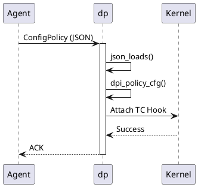
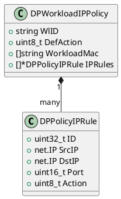
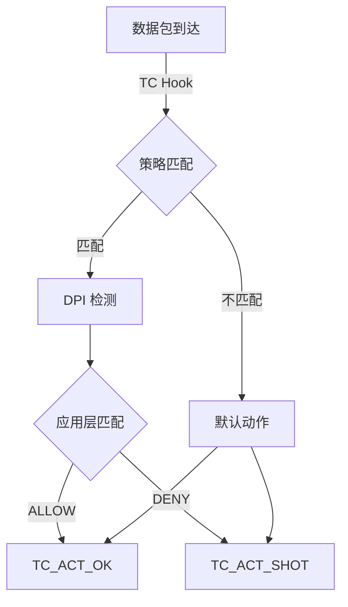

# eBPF 微隔离项目图表规划指南

## 目录

- [一、图表体系概览](#一图表体系概览)
- [二、系统架构图](#二系统架构图)
- [三、数据流图](#三数据流图)
- [四、时序图](#四时序图)
- [五、状态机图](#五状态机图)
- [六、组件交互图](#六组件交互图)
- [七、代码结构图](#七代码结构图)
- [八、部署架构图](#八部署架构图)
- [九、绘图工具推荐](#九绘图工具推荐)

---

## 一、图表体系概览

### 1.1 图表分类体系

```
eBPF 微隔离项目图表体系
│
├─ 1. 系统架构图 (System Architecture)
│   ├─ 整体架构图
│   ├─ 分层架构图
│   ├─ 模块划分图
│   └─ 技术栈图
│
├─ 2. 数据流图 (Data Flow Diagram)
│   ├─ 策略下发流程图
│   ├─ 数据包处理流程图
│   ├─ 日志上报流程图
│   └─ 会话跟踪流程图
│
├─ 3. 时序图 (Sequence Diagram)
│   ├─ 容器启动策略应用时序图
│   ├─ 数据包过滤时序图
│   ├─ Agent-dp 通信时序图
│   └─ 威胁检测上报时序图
│
├─ 4. 状态机图 (State Machine Diagram)
│   ├─ 会话状态机
│   ├─ 策略生命周期状态机
│   ├─ 连接状态机 (TCP)
│   └─ FQDN 解析状态机
│
├─ 5. 组件交互图 (Component Interaction)
│   ├─ Controller-Agent-dp 交互图
│   ├─ dp 内部模块交互图
│   ├─ Agent 内部模块交互图
│   └─ eBPF 与 Kernel 交互图
│
├─ 6. 代码结构图 (Code Structure)
│   ├─ dp 代码模块图
│   ├─ Agent 代码模块图
│   ├─ 关键函数调用链图
│   └─ 数据结构关系图
│
├─ 7. 部署架构图 (Deployment Architecture)
│   ├─ 单主机部署图
│   ├─ Kubernetes 部署图
│   ├─ 网络拓扑图
│   └─ 数据路径图
│
└─ 8. 性能分析图 (Performance Analysis)
    ├─ 延迟分析图
    ├─ 吞吐量分析图
    ├─ 内存使用图
    └─ CPU 使用图
```

### 1.2 图表优先级

| 优先级 | 图表类型 | 重要性 | 难度 |
|--------|----------|--------|------|
| ⭐⭐⭐⭐⭐ | 整体架构图 | 必须 | 中 |
| ⭐⭐⭐⭐⭐ | 数据包处理流程图 | 必须 | 高 |
| ⭐⭐⭐⭐⭐ | 策略下发流程图 | 必须 | 高 |
| ⭐⭐⭐⭐ | Agent-dp 通信时序图 | 重要 | 中 |
| ⭐⭐⭐⭐ | dp 内部模块交互图 | 重要 | 中 |
| ⭐⭐⭐⭐ | 会话状态机 | 重要 | 低 |
| ⭐⭐⭐ | Kubernetes 部署图 | 有用 | 低 |
| ⭐⭐⭐ | 代码模块图 | 有用 | 低 |

---

## 二、系统架构图

### 2.1 整体架构图（四层架构）

**目的**：展示系统的整体结构和各组件关系

**建议内容**：

```
┌─────────────────────────────────────────────────────────────┐
│                     用户界面层 (UI Layer)                    │
│  ┌──────────────┐  ┌──────────────┐  ┌──────────────┐      │
│  │   Web UI     │  │  REST API    │  │   CLI Tool   │      │
│  └──────────────┘  └──────────────┘  └──────────────┘      │
└─────────────────┬───────────────────────────────────────────┘
                  │
┌─────────────────▼───────────────────────────────────────────┐
│                   控制平面层 (Control Plane)                 │
│  ┌────────────────────────────────────────────────────┐    │
│  │              Controller (集中管理)                  │    │
│  │  ┌──────────────────┐  ┌──────────────────┐       │    │
│  │  │  Policy Engine   │  │  Config Manager  │       │    │
│  │  └──────────────────┘  └──────────────────┘       │    │
│  │  ┌──────────────────┐  ┌──────────────────┐       │    │
│  │  │  Threat Analysis │  │  Cluster Manager │       │    │
│  │  └──────────────────┘  └──────────────────┘       │    │
│  └────────────────────────────────────────────────────┘    │
│                           │                                 │
│                    ┌──────▼──────┐                         │
│                    │  etcd/Consul│                         │
│                    │ (配置存储)   │                         │
│                    └─────────────┘                         │
└─────────────────┬───────────────────────────────────────────┘
                  │ gRPC/REST API
┌─────────────────▼───────────────────────────────────────────┐
│                    代理层 (Agent Layer)                      │
│  ┌─────────────────────────────────────────────────────┐   │
│  │  Agent (每个节点一个实例)                             │   │
│  │  ┌────────────┐ ┌────────────┐ ┌────────────┐      │   │
│  │  │  Policy    │ │  Workload  │ │  Network   │      │   │
│  │  │  Manager   │ │  Monitor   │ │  Scanner   │      │   │
│  │  └────────────┘ └────────────┘ └────────────┘      │   │
│  │  ┌────────────┐ ┌────────────┐ ┌────────────┐      │   │
│  │  │  Container │ │  Process   │ │    File    │      │   │
│  │  │  Manager   │ │  Monitor   │ │  Monitor   │      │   │
│  │  └────────────┘ └────────────┘ └────────────┘      │   │
│  └─────────────────────────────────────────────────────┘   │
│                           │ Unix Socket (JSON)              │
│  ┌─────────────────────────────────────────────────────┐   │
│  │  dp (Data Plane - C 实现)                            │   │
│  │  ┌────────────┐ ┌────────────┐ ┌────────────┐      │   │
│  │  │   Policy   │ │    DPI     │ │  Session   │      │   │
│  │  │   Engine   │ │  (深度包   │ │  Tracking  │      │   │
│  │  │            │ │   检测)    │ │            │      │   │
│  │  └────────────┘ └────────────┘ └────────────┘      │   │
│  │  ┌────────────┐ ┌────────────┐ ┌────────────┐      │   │
│  │  │   FQDN     │ │    DLP     │ │    WAF     │      │   │
│  │  │  Resolver  │ │  (数据防   │ │  (应用防   │      │   │
│  │  │            │ │   泄漏)    │ │   火墙)    │      │   │
│  │  └────────────┘ └────────────┘ └────────────┘      │   │
│  └─────────────────────────────────────────────────────┘   │
└─────────────────┬───────────────────────────────────────────┘
                  │ eBPF/Netfilter/TAP
┌─────────────────▼───────────────────────────────────────────┐
│                  数据平面层 (Data Plane)                     │
│  ┌─────────────────────────────────────────────────────┐   │
│  │           Linux Kernel (eBPF 执行环境)               │   │
│  │  ┌────────────┐ ┌────────────┐ ┌────────────┐      │   │
│  │  │ TC Ingress │ │ TC Egress  │ │  Netfilter │      │   │
│  │  │   Hook     │ │   Hook     │ │   Queue    │      │   │
│  │  └────────────┘ └────────────┘ └────────────┘      │   │
│  │  ┌────────────┐ ┌────────────┐ ┌────────────┐      │   │
│  │  │  BPF Map   │ │  BPF Map   │ │   Socket   │      │   │
│  │  │ (策略存储) │ │ (会话表)   │ │   Filter   │      │   │
│  │  └────────────┘ └────────────┘ └────────────┘      │   │
│  └─────────────────────────────────────────────────────┘   │
│                           │                                 │
│  ┌─────────────────────────────────────────────────────┐   │
│  │          网络设备 (Network Devices)                   │   │
│  │  ┌────────────┐ ┌────────────┐ ┌────────────┐      │   │
│  │  │    eth0    │ │    veth    │ │    tap0    │      │   │
│  │  └────────────┘ └────────────┘ └────────────┘      │   │
│  └─────────────────────────────────────────────────────┘   │
└─────────────────────────────────────────────────────────────┘
```

**关键点**：
- 4 层架构：UI 层、控制平面、代理层、数据平面
- Agent (Go) 与 dp (C) 的分工
- eBPF 在 Kernel 中的位置
- 各组件的通信方式（gRPC、Unix Socket、eBPF）

### 2.2 分层架构图（OSI 模型映射）

**目的**：展示微隔离系统与网络协议栈的关系

```
应用层 (L7)    ┌─────────────────────────────────┐
               │  DPI (HTTP, MySQL, Redis...)    │
               │  WAF (Web Application Firewall) │
               └─────────────────────────────────┘

传输层 (L4)    ┌─────────────────────────────────┐
               │  TCP/UDP 策略匹配               │
               │  端口过滤 (Port Filtering)      │
               │  会话跟踪 (Session Tracking)    │
               └─────────────────────────────────┘

网络层 (L3)    ┌─────────────────────────────────┐
               │  IP 地址匹配                    │
               │  FQDN → IP 映射                 │
               │  五元组过滤                     │
               └─────────────────────────────────┘

链路层 (L2)    ┌─────────────────────────────────┐
               │  MAC 地址识别                   │
               │  VLAN 处理                      │
               │  eBPF TC Hook (Ingress/Egress)  │
               └─────────────────────────────────┘

物理层 (L1)    ┌─────────────────────────────────┐
               │  网络设备 (eth0, veth, tap)     │
               └─────────────────────────────────┘
```

### 2.3 模块划分图

**目的**：展示 dp 内部模块的详细划分

```
dp (Data Plane)
│
├── ctrl (控制接口)
│   ├── dp_ctrl_loop()          // 主控制循环
│   ├── dp_ctrl_handler()       // 消息处理器
│   └── dp_ctrl_cfg_policy()    // 策略配置
│
├── dpi (深度包检测)
│   ├── dpi_packet.c            // 数据包处理
│   ├── dpi_session.c           // 会话管理
│   ├── dpi_policy.c            // 策略匹配
│   └── parsers/                // 协议解析器
│       ├── dpi_http.c
│       ├── dpi_mysql.c
│       ├── dpi_dns.c
│       └── ... (20+ 协议)
│
├── sig (签名检测)
│   ├── dpi_search.c            // 模式匹配
│   ├── dpi_hs.c                // HyperScan 引擎
│   └── dpi_sig.c               // 签名管理
│
├── utils (工具库)
│   ├── rcu_map.c               // RCU 哈希表
│   ├── timer_wheel.c           // 定时器轮
│   ├── bitmap.c                // 位图
│   └── helper.c                // 辅助函数
│
└── data (数据路径)
    ├── dp_data.c               // 数据处理主循环
    ├── dp_ring.c               // 环形缓冲区
    └── dp_nfq.c                // Netfilter Queue
```

---

## 三、数据流图

### 3.1 策略下发流程图（最重要！）

**目的**：展示策略从 Controller 到 eBPF 的完整路径

```
┌─────────────────────────────────────────────────────────────┐
│  Step 1: 用户配置策略                                        │
│  ┌──────────┐                                               │
│  │   User   │ → Web UI/API                                  │
│  └──────────┘                                               │
│       │                                                      │
│       ▼                                                      │
│  ┌──────────────────────────────────────────────────┐      │
│  │  Controller (集中管理)                            │      │
│  │  ┌────────────────────────────────────────────┐  │      │
│  │  │  Policy:                                   │  │      │
│  │  │  - from: "container-A"                     │  │      │
│  │  │  - to: "nv.fqdn.api.github.com"            │  │      │
│  │  │  - ports: "tcp/443"                        │  │      │
│  │  │  - action: "allow"                         │  │      │
│  │  │  - applications: ["HTTPS"]                 │  │      │
│  │  └────────────────────────────────────────────┘  │      │
│  └──────────────────────────────────────────────────┘      │
└─────────────────┬───────────────────────────────────────────┘
                  │ gRPC Watch (etcd change notification)
┌─────────────────▼───────────────────────────────────────────┐
│  Step 2: Agent 接收并计算策略                                │
│  ┌──────────────────────────────────────────────────┐      │
│  │  Agent (Go)                                      │      │
│  │  ┌────────────────────────────────────────────┐  │      │
│  │  │  policy/network.go                         │  │      │
│  │  │  calculateIPPolicyFunc()                   │  │      │
│  │  │    │                                       │  │      │
│  │  │    ├─> 解析 from/to workload               │  │      │
│  │  │    │   ├─ isWorkloadFqdn() → DNS 解析     │  │      │
│  │  │    │   ├─ isWorkloadIP() → 提取 IP        │  │      │
│  │  │    │   └─ 查找 container MAC              │  │      │
│  │  │    │                                       │  │      │
│  │  │    ├─> 解析端口范围                        │  │      │
│  │  │    │   └─ "tcp/443" → port=443, proto=6   │  │      │
│  │  │    │                                       │  │      │
│  │  │    └─> 构造 DPPolicyIPRule                 │  │      │
│  │  │        {                                   │  │      │
│  │  │          ID: 1001,                         │  │      │
│  │  │          SrcIP: "192.168.1.10",            │  │      │
│  │  │          DstIP: "0.0.0.0",                 │  │      │
│  │  │          Port: 443,                        │  │      │
│  │  │          IPProto: 6,                       │  │      │
│  │  │          Action: 1,                        │  │      │
│  │  │          Fqdn: "api.github.com",           │  │      │
│  │  │          Apps: [{App: 101, ...}]           │  │      │
│  │  │        }                                   │  │      │
│  │  └────────────────────────────────────────────┘  │      │
│  └──────────────────────────────────────────────────┘      │
└─────────────────┬───────────────────────────────────────────┘
                  │
┌─────────────────▼───────────────────────────────────────────┐
│  Step 3: Agent 序列化并发送                                  │
│  ┌──────────────────────────────────────────────────┐      │
│  │  dp/ctrl.go                                      │      │
│  │  DPCtrlConfigPolicy()                            │      │
│  │    │                                             │      │
│  │    ├─> 分批处理（40 条/批）                      │      │
│  │    │   ├─ 第一批: flag = MSG_START              │      │
│  │    │   ├─ 中间批: flag = 0                      │      │
│  │    │   └─ 最后批: flag = MSG_END                │      │
│  │    │                                             │      │
│  │    ├─> json.Marshal(DPPolicyCfgReq)             │      │
│  │    │   {                                         │      │
│  │    │     "ctrl_cfg_policy": {                   │      │
│  │    │       "cmd": 1,                             │      │
│  │    │       "flag": 3,                            │      │
│  │    │       "defact": 2,                          │      │
│  │    │       "dir": 3,                             │      │
│  │    │       "mac": ["aa:bb:cc:dd:ee:ff"],         │      │
│  │    │       "rules": [...]                        │      │
│  │    │     }                                       │      │
│  │    │   }                                         │      │
│  │    │                                             │      │
│  │    └─> dpSendMsg(msg)                           │      │
│  │        → Unix Socket Write                      │      │
│  └──────────────────────────────────────────────────┘      │
└─────────────────┬───────────────────────────────────────────┘
                  │ Unix Socket (/tmp/dp_listen.sock)
                  │ JSON Message
┌─────────────────▼───────────────────────────────────────────┐
│  Step 4: dp 接收并解析 JSON                                  │
│  ┌──────────────────────────────────────────────────┐      │
│  │  dp (C)                                          │      │
│  │  ctrl.c                                          │      │
│  │    │                                             │      │
│  │    ├─> dp_ctrl_loop()                           │      │
│  │    │   └─ select() 检测到消息                    │      │
│  │    │                                             │      │
│  │    ├─> dp_ctrl_handler()                        │      │
│  │    │   ├─ recvfrom() 读取 JSON                  │      │
│  │    │   ├─ json_loads() 解析                     │      │
│  │    │   └─ 识别 "ctrl_cfg_policy"                │      │
│  │    │                                             │      │
│  │    └─> dp_ctrl_cfg_policy()                     │      │
│  │        ├─ 解析 MAC 列表                         │      │
│  │        ├─ 解析规则数组                          │      │
│  │        │   ├─ id, sip, dip, port, proto         │      │
│  │        │   ├─ action, ingress                   │      │
│  │        │   ├─ FQDN (可选)                       │      │
│  │        │   └─ apps[] (应用层规则)               │      │
│  │        │                                         │      │
│  │        └─> 构造 dpi_policy_t 结构                │      │
│  │            {                                     │      │
│  │              num_macs: 1,                        │      │
│  │              mac_list: [0xaa, 0xbb, ...],        │      │
│  │              def_action: 2,                      │      │
│  │              apply_dir: 3,                       │      │
│  │              num_rules: 1,                       │      │
│  │              rule_list: [...]                    │      │
│  │            }                                     │      │
│  └──────────────────────────────────────────────────┘      │
└─────────────────┬───────────────────────────────────────────┘
                  │
┌─────────────────▼───────────────────────────────────────────┐
│  Step 5: dp 编译并安装策略                                   │
│  ┌──────────────────────────────────────────────────┐      │
│  │  dpi/dpi_policy.c                                │      │
│  │  dpi_policy_cfg(cmd, &policy, flag)              │      │
│  │    │                                             │      │
│  │    ├─> 编译规则树                                │      │
│  │    │   ├─ 构建快速查找树（LPM Trie）            │      │
│  │    │   ├─ 优化规则顺序                          │      │
│  │    │   └─ 预编译正则表达式（HyperScan）         │      │
│  │    │                                             │      │
│  │    ├─> 插入到策略引擎                            │      │
│  │    │   └─ 关联到 io_ep_t (Endpoint)             │      │
│  │    │                                             │      │
│  │    └─> 通知数据处理线程                          │      │
│  │        └─ 策略版本号 +1                         │      │
│  └──────────────────────────────────────────────────┘      │
└─────────────────┬───────────────────────────────────────────┘
                  │
┌─────────────────▼───────────────────────────────────────────┐
│  Step 6: 数据包匹配执行                                      │
│  ┌──────────────────────────────────────────────────┐      │
│  │  数据包到达                                       │      │
│  │  192.168.1.10:52345 → 140.82.113.5:443 (TCP)     │      │
│  └──────────────────────────────────────────────────┘      │
│                     │                                       │
│  ┌─────────────────▼─────────────────────────────┐        │
│  │  dpi/dpi_packet.c                             │        │
│  │  dpi_recv_packet()                            │        │
│  │    │                                           │        │
│  │    ├─> 提取五元组                              │        │
│  │    │   ├─ src_ip: 192.168.1.10                │        │
│  │    │   ├─ dst_ip: 140.82.113.5                │        │
│  │    │   ├─ src_port: 52345                     │        │
│  │    │   ├─ dst_port: 443                       │        │
│  │    │   └─ proto: TCP                          │        │
│  │    │                                           │        │
│  │    ├─> 查找 FQDN 映射                          │        │
│  │    │   └─ 140.82.113.5 → "api.github.com"     │        │
│  │    │                                           │        │
│  │    ├─> 匹配策略规则                            │        │
│  │    │   ├─ 规则 1001: fqdn="api.github.com" ✅ │        │
│  │    │   ├─ 规则 1001: dport=443 ✅             │        │
│  │    │   └─ 规则 1001: proto=TCP ✅             │        │
│  │    │                                           │        │
│  │    ├─> DPI 检测                                │        │
│  │    │   └─ 识别为 HTTPS (app: 101)             │        │
│  │    │                                           │        │
│  │    ├─> 匹配应用层规则                          │        │
│  │    │   ├─ app: 101 (HTTPS) ✅                 │        │
│  │    │   └─ action: ALLOW (1)                   │        │
│  │    │                                           │        │
│  │    └─> 执行动作                                │        │
│  │        └─ TC_ACT_OK (放行)                    │        │
│  └───────────────────────────────────────────────┘        │
└─────────────────────────────────────────────────────────────┘
```

**关键时间节点**：
- Controller → Agent: 100-500ms (网络 + 计算)
- Agent → dp: 1-5ms (Unix Socket + JSON 解析)
- dp 策略编译: 10-50ms (取决于规则数量)
- 数据包匹配: <10μs (内存查找)

### 3.2 数据包处理流程图（详细版）

**目的**：展示单个数据包从网卡到应用的完整路径

```
┌────────────────────────────────────────────────────────────┐
│  物理网卡接收数据包                                         │
│  ┌──────────┐                                              │
│  │   eth0   │ ← 数据包到达                                 │
│  └──────────┘                                              │
└────────┬───────────────────────────────────────────────────┘
         │
         ▼
┌────────────────────────────────────────────────────────────┐
│  Kernel 网络栈                                              │
│  ┌──────────────────────────────────────────────────┐     │
│  │  1. L2 处理 (链路层)                              │     │
│  │     ├─ 以太网帧解析                               │     │
│  │     ├─ VLAN 处理                                  │     │
│  │     └─ MAC 地址过滤                               │     │
│  └──────────────────────────────────────────────────┘     │
│                           │                                │
│  ┌────────────────────────▼──────────────────────────┐    │
│  │  2. TC Ingress Hook (eBPF)                        │    │
│  │     ┌──────────────────────────────────────────┐  │    │
│  │     │  BPF 程序: tc_ingress_filter()           │  │    │
│  │     │    │                                     │  │    │
│  │     │    ├─> 读取 skb 元数据                   │  │    │
│  │     │    │   ├─ skb->protocol (协议类型)       │  │    │
│  │     │    │   ├─ skb->ifindex (网卡索引)        │  │    │
│  │     │    │   └─ skb->len (数据包长度)          │  │    │
│  │     │    │                                     │  │    │
│  │     │    ├─> 提取 L3/L4 头部                    │  │    │
│  │     │    │   ├─ struct iphdr *iph              │  │    │
│  │     │    │   ├─ struct tcphdr *tcph            │  │    │
│  │     │    │   └─ 边界检查 (Verifier 要求)       │  │    │
│  │     │    │                                     │  │    │
│  │     │    ├─> 查找 BPF Map (策略匹配)           │  │    │
│  │     │    │   ├─ policy_map (五元组查找)        │  │    │
│  │     │    │   ├─ session_map (会话查找)         │  │    │
│  │     │    │   └─ stats_map (统计更新)           │  │    │
│  │     │    │                                     │  │    │
│  │     │    └─> 返回判决                          │  │    │
│  │     │        ├─ TC_ACT_OK (继续)              │  │    │
│  │     │        ├─ TC_ACT_SHOT (丢弃)            │  │    │
│  │     │        └─ TC_ACT_REDIRECT (重定向)      │  │    │
│  │     └──────────────────────────────────────────┘  │    │
│  └───────────────────────────────────────────────────┘    │
│         │                                                  │
│         ├─ TC_ACT_OK → 继续                               │
│         └─ TC_ACT_SHOT → 丢弃 ❌                          │
│                           │                                │
│  ┌────────────────────────▼──────────────────────────┐    │
│  │  3. Netfilter Hook (可选)                         │    │
│  │     ┌──────────────────────────────────────────┐  │    │
│  │     │  NF_INET_PRE_ROUTING                     │  │    │
│  │     │    │                                     │  │    │
│  │     │    ├─> iptables 规则匹配                 │  │    │
│  │     │    │   └─ NFQUEUE target                │  │    │
│  │     │    │      └─ 数据包入队到 dp             │  │    │
│  │     │    │                                     │  │    │
│  │     │    └─> 返回 NF_ACCEPT/NF_DROP            │  │    │
│  │     └──────────────────────────────────────────┘  │    │
│  └───────────────────────────────────────────────────┘    │
│                           │                                │
│  ┌────────────────────────▼──────────────────────────┐    │
│  │  4. L3 处理 (网络层)                              │    │
│  │     ├─ IP 路由查找                                │    │
│  │     ├─ IP 分片重组                                │    │
│  │     └─ TTL 递减                                   │    │
│  └───────────────────────────────────────────────────┘    │
│                           │                                │
│  ┌────────────────────────▼──────────────────────────┐    │
│  │  5. L4 处理 (传输层)                              │    │
│  │     ├─ TCP 状态机                                 │    │
│  │     ├─ 校验和验证                                 │    │
│  │     └─ 端口查找                                   │    │
│  └───────────────────────────────────────────────────┘    │
└────────┬───────────────────────────────────────────────────┘
         │
         ▼
┌────────────────────────────────────────────────────────────┐
│  用户态 dp 处理 (Netfilter Queue 模式)                      │
│  ┌──────────────────────────────────────────────────┐     │
│  │  dp_data_thr()                                   │     │
│  │    │                                             │     │
│  │    ├─> nfq_handle_packet()                      │     │
│  │    │   └─ 从 NFQUEUE 读取数据包                  │     │
│  │    │                                             │     │
│  │    ├─> dpi_recv_packet()                        │     │
│  │    │   ├─ 解析 L7 协议 (DPI)                     │     │
│  │    │   │   ├─ HTTP 解析器                        │     │
│  │    │   │   ├─ MySQL 解析器                       │     │
│  │    │   │   └─ ... (20+ 协议)                    │     │
│  │    │   │                                         │     │
│  │    │   ├─ 会话跟踪                               │     │
│  │    │   │   ├─ 查找现有会话                       │     │
│  │    │   │   ├─ 创建新会话                         │     │
│  │    │   │   └─ 更新统计信息                       │     │
│  │    │   │                                         │     │
│  │    │   ├─ 策略匹配                               │     │
│  │    │   │   ├─ 五元组匹配                         │     │
│  │    │   │   ├─ FQDN 匹配                          │     │
│  │    │   │   ├─ 应用层匹配                         │     │
│  │    │   │   └─ DLP/WAF 检测                       │     │
│  │    │   │                                         │     │
│  │    │   └─> 返回判决                              │     │
│  │    │       ├─ DP_POLICY_ACTION_OPEN              │     │
│  │    │       ├─ DP_POLICY_ACTION_DENY              │     │
│  │    │       └─ DP_POLICY_ACTION_VIOLATE           │     │
│  │    │                                             │     │
│  │    └─> nfq_set_verdict()                        │     │
│  │        └─ 返回判决到 Kernel                      │     │
│  └──────────────────────────────────────────────────┘     │
└────────┬───────────────────────────────────────────────────┘
         │
         ├─ ACCEPT → 继续到应用
         └─ DROP → 丢弃 ❌
         │
         ▼
┌────────────────────────────────────────────────────────────┐
│  应用程序接收                                               │
│  ┌──────────┐                                              │
│  │  Socket  │ ← 数据到达应用层                             │
│  │ (recv)   │                                              │
│  └──────────┘                                              │
└────────────────────────────────────────────────────────────┘
```

**关键性能指标**：
- eBPF TC Hook 延迟: <5μs
- dp DPI 检测延迟: 10-100μs (取决于协议复杂度)
- 总延迟目标: <10μs (纯 eBPF) 或 <200μs (Netfilter Queue)

### 3.3 日志上报流程图

**目的**：展示威胁日志如何从 dp 上报到 Controller

```
数据包被拒绝
    │
    ▼
┌─────────────────────────────────────────────┐
│  dp 记录威胁日志                             │
│  dpi_log_threat()                           │
│    │                                        │
│    ├─> 构造 DPMsgThreatLog                 │
│    │   ├─ ThreatID: 1001                   │
│    │   ├─ Severity: HIGH                   │
│    │   ├─ SrcIP/DstIP                      │
│    │   ├─ Packet capture (前 128 字节)     │
│    │   └─ Timestamp                        │
│    │                                        │
│    └─> 入队到威胁日志队列                   │
└─────────────────┬───────────────────────────┘
                  │
                  ▼
┌─────────────────────────────────────────────┐
│  dp 定期上报 (每 2 秒)                       │
│  dp_ctrl_consume_threat_log()               │
│    │                                        │
│    ├─> 从队列取出日志                       │
│    │                                        │
│    ├─> 构造二进制消息                       │
│    │   └─ DPMsgHdr + DPMsgThreatLog        │
│    │                                        │
│    └─> dp_ctrl_notify_ctrl(buf, len)       │
│        └─ sendto(/tmp/ctrl_listen.sock)    │
└─────────────────┬───────────────────────────┘
                  │ Unix Socket (Binary)
                  ▼
┌─────────────────────────────────────────────┐
│  Agent 接收日志                              │
│  listenDP()                                 │
│    │                                        │
│    ├─> Read from socket                    │
│    │                                        │
│    ├─> dpMessenger(buf)                    │
│    │   ├─ ParseDPMsgHeader()               │
│    │   └─ Kind == DP_KIND_THREAT_LOG       │
│    │                                        │
│    └─> dpMsgThreatLog(msg)                 │
│        ├─ binary.Read(&tlog)               │
│        ├─ 转换为 CLUSThreatLog             │
│        └─ taskCallback(&task)              │
└─────────────────┬───────────────────────────┘
                  │
                  ▼
┌─────────────────────────────────────────────┐
│  Agent 处理日志                              │
│  handleDPTask()                             │
│    │                                        │
│    ├─> 关联 Workload 信息                   │
│    │   ├─ MAC → Container ID               │
│    │   ├─ IP → Service Name                │
│    │   └─ 添加上下文信息                    │
│    │                                        │
│    ├─> 本地聚合去重                         │
│    │   └─ 相同威胁 1 分钟内只上报一次        │
│    │                                        │
│    └─> 发送到 Controller                   │
│        └─ gRPC Stream                      │
└─────────────────┬───────────────────────────┘
                  │ gRPC
                  ▼
┌─────────────────────────────────────────────┐
│  Controller 存储并分析                       │
│    │                                        │
│    ├─> 写入数据库 (etcd/PostgreSQL)         │
│    │                                        │
│    ├─> 威胁关联分析                         │
│    │   ├─ 同一攻击者的多次尝试              │
│    │   ├─ 横向移动检测                      │
│    │   └─ 生成安全事件                      │
│    │                                        │
│    └─> 通知用户                             │
│        ├─ Web UI 显示                      │
│        ├─ Email 告警                       │
│        └─ Webhook 集成                     │
└─────────────────────────────────────────────┘
```

---

## 四、时序图

### 4.1 容器启动策略应用时序图

**目的**：展示新容器启动时，策略如何自动应用

```
Container   Docker   Agent   Controller   dp      Kernel
   │          │        │         │        │        │
   │──start──>│        │         │        │        │
   │          │        │         │        │        │
   │          │──event─>│         │        │        │
   │          │  (创建) │         │        │        │
   │          │        │         │        │        │
   │          │        │─inspect─>│        │        │
   │          │        │ (获取信息)│        │        │
   │          │        │         │        │        │
   │          │        │<─metadata│        │        │
   │          │        │ (MAC,IP,│        │        │
   │          │        │  Labels) │        │        │
   │          │        │         │        │        │
   │          │        │──────────────────>│        │
   │          │        │  Report Container │        │
   │          │        │   (gRPC)          │        │
   │          │        │         │        │        │
   │          │        │         │        │        │
   │          │        │         │<───Policy        │
   │          │        │         │   Calculation    │
   │          │        │         │   (基于 Group)   │
   │          │        │         │        │        │
   │          │        │<─────────────────│        │
   │          │        │  Policy (gRPC)   │        │
   │          │        │  {                │        │
   │          │        │   from: "web",   │        │
   │          │        │   to: "db",      │        │
   │          │        │   action: "allow"│        │
   │          │        │  }                │        │
   │          │        │         │        │        │
   │          │        │─calculatePolicy─>│        │
   │          │        │ (转换为 DP 格式)  │        │
   │          │        │         │        │        │
   │          │        │─────────────────>│        │
   │          │        │ AddMAC (JSON)    │        │
   │          │        │ {mac, iface}     │        │
   │          │        │         │        │        │
   │          │        │         │        │<─ACK   │
   │          │        │         │        │        │
   │          │        │─────────────────>│        │
   │          │        │ ConfigPolicy     │        │
   │          │        │ (JSON)           │        │
   │          │        │ {rules: [...]}   │        │
   │          │        │         │        │        │
   │          │        │         │        │──compile│
   │          │        │         │        │  policy │
   │          │        │         │        │        │
   │          │        │         │        │<─Done  │
   │          │        │         │        │        │
   │          │        │─setupTap/Nfq────>│        │
   │          │        │         │        │        │
   │          │        │         │        │────────>│
   │          │        │         │        │ Attach  │
   │          │        │         │        │ TC/NFQ  │
   │          │        │         │        │        │
   │          │<───────running───│        │        │
   │          │        │         │        │        │
   │──ready──>App      │         │        │        │
   │          │        │         │        │        │
   │          │        │         │        │        │
   Packet arrives on eth0        │        │        │
   │          │        │         │        │        │
   │          │        │         │        │<───────│
   │          │        │         │        │ TC Hook│
   │          │        │         │        │        │
   │          │        │         │        │─match─>│
   │          │        │         │        │ policy │
   │          │        │         │        │        │
   │          │        │         │        │<─ACT_OK│
   │<─────────packet delivered───│        │        │
```

**关键时间**：
- 容器创建到策略应用：500ms - 2s
- 策略编译：10-50ms
- eBPF 附加：<10ms

### 4.2 数据包过滤时序图（eBPF 模式）

```
App      Socket   Kernel    TC Hook   BPF Map    dp
 │         │        │         │         │        │
 │─send──>│        │         │         │        │
 │         │        │         │         │        │
 │         │──syscall──>│     │         │        │
 │         │  (sendto)  │     │         │        │
 │         │        │         │         │        │
 │         │        │─build─>│         │        │
 │         │        │  skb   │         │        │
 │         │        │         │         │        │
 │         │        │<────────│         │        │
 │         │        │  Egress │         │        │
 │         │        │  Hook   │         │        │
 │         │        │         │         │        │
 │         │        │         │─extract─>        │
 │         │        │         │ 5-tuple │        │
 │         │        │         │         │        │
 │         │        │         │─lookup──────────>│
 │         │        │         │ session_map      │
 │         │        │         │         │        │
 │         │        │         │<────────────HIT  │
 │         │        │         │ cached_action    │
 │         │        │         │         │        │
 │         │        │         │─update─>│        │
 │         │        │         │ stats   │        │
 │         │        │         │         │        │
 │         │        │         │<────TC_ACT_OK    │
 │         │        │         │  (3μs)  │        │
 │         │        │         │         │        │
 │         │        │<────────│         │        │
 │         │        │  继续   │         │        │
 │         │        │         │         │        │
 │         │────────────────────────────>eth0    │
 │         │        │         │         │        │
```

**性能关键点**：
- TC Hook 执行时间：<5μs
- BPF Map 查找：<1μs (哈希表)
- 会话命中率：>95% (Fast Path)

---

## 五、状态机图

### 5.1 会话状态机（TCP）

**目的**：展示 dp 如何跟踪 TCP 连接状态

```
                    ┌──────────────┐
                    │    CLOSED    │ (初始状态)
                    └──────┬───────┘
                           │ SYN
                           ▼
                    ┌──────────────┐
         ┌─────────>│   SYN_SENT   │
         │          └──────┬───────┘
         │                 │ SYN+ACK
         │                 ▼
         │          ┌──────────────┐
         │          │ ESTABLISHED  │<──────┐
         │          └──────┬───────┘       │
         │                 │ FIN           │ Data交换
         │                 ▼               │
         │          ┌──────────────┐       │
         │          │   FIN_WAIT   │───────┘
         │          └──────┬───────┘
         │                 │ ACK
         │                 ▼
         │          ┌──────────────┐
         │          │  TIME_WAIT   │
         │          └──────┬───────┘
         │                 │ Timeout (2*MSL)
         │                 ▼
         │          ┌──────────────┐
         └──────────│    CLOSED    │
                    └──────────────┘
                           │
                           │ Timeout / RST
                           ▼
                    ┌──────────────┐
                    │   DELETED    │ (释放资源)
                    └──────────────┘
```

**状态转换事件**：
- `SYN` - 客户端发起连接
- `SYN+ACK` - 服务器响应
- `ACK` - 连接建立确认
- `FIN` - 一方关闭连接
- `RST` - 连接重置
- `Timeout` - 超时（默认 30 秒无活动）

**dp 中的实现**：
```c
// dpi/dpi_session.c
typedef enum {
    DP_SESS_STATE_INIT = 0,
    DP_SESS_STATE_SYN_SENT,
    DP_SESS_STATE_ESTABLISHED,
    DP_SESS_STATE_FIN_WAIT,
    DP_SESS_STATE_TIME_WAIT,
    DP_SESS_STATE_CLOSED,
} dp_sess_state_t;

void dpi_session_update_state(dpi_session_t *sess, uint8_t flags) {
    switch (sess->state) {
    case DP_SESS_STATE_INIT:
        if (flags & TCP_FLAG_SYN) {
            sess->state = DP_SESS_STATE_SYN_SENT;
        }
        break;
    case DP_SESS_STATE_SYN_SENT:
        if (flags & (TCP_FLAG_SYN | TCP_FLAG_ACK)) {
            sess->state = DP_SESS_STATE_ESTABLISHED;
        }
        break;
    // ...
    }
}
```

### 5.2 策略生命周期状态机

```
         ┌─────────────┐
         │   CREATED   │ (Agent 创建)
         └──────┬──────┘
                │ Calculate
                ▼
         ┌─────────────┐
         │  COMPILED   │ (规则编译)
         └──────┬──────┘
                │ Send to dp
                ▼
         ┌─────────────┐
    ┌───>│   PENDING   │ (等待 dp 确认)
    │    └──────┬──────┘
    │           │ dp ACK
    │           ▼
    │    ┌─────────────┐
    │    │   ACTIVE    │ (正在使用)
    │    └──────┬──────┘
    │           │
    │           ├─ Update → PENDING (重新编译)
    │           │
    │           ├─ Delete
    │           │
    │           ▼
    │    ┌─────────────┐
    └────│  DELETING   │ (标记删除)
         └──────┬──────┘
                │ Cleanup
                ▼
         ┌─────────────┐
         │   DELETED   │ (已删除)
         └─────────────┘
```

---

## 六、组件交互图

### 6.1 Controller-Agent-dp 三层交互

**目的**：展示三大组件的详细交互关系

```
┌───────────────────────────────────────────────────────────┐
│                      Controller                           │
│  ┌─────────────────────────────────────────────────────┐ │
│  │  Policy Manager                                     │ │
│  │  ┌───────────┐  ┌───────────┐  ┌───────────┐      │ │
│  │  │  Create   │  │  Update   │  │  Delete   │      │ │
│  │  └─────┬─────┘  └─────┬─────┘  └─────┬─────┘      │ │
│  │        └────────────┬─────────────────┘            │ │
│  └────────────────────┬─────────────────────────────────┘ │
│                       │                                   │
└───────────────────────┼───────────────────────────────────┘
                        │
                        │ gRPC Watch (etcd change)
                        │ PolicyUpdate(policy_id, rules)
                        ▼
┌───────────────────────────────────────────────────────────┐
│                        Agent                              │
│  ┌─────────────────────────────────────────────────────┐ │
│  │  Policy Module (policy/network.go)                  │ │
│  │  ┌───────────────────────────────────────────────┐  │ │
│  │  │  calculateIPPolicyFunc()                      │  │ │
│  │  │    ├─ 解析 workload (container/VM)            │  │ │
│  │  │    ├─ 解析 FQDN → DNS 查询                   │  │ │
│  │  │    ├─ 解析端口范围                           │  │ │
│  │  │    └─ 构造 DPPolicyIPRule                    │  │ │
│  │  └───────────────────────────────────────────────┘  │ │
│  └──────────────────────┬──────────────────────────────────┘ │
│                         │                                   │
│  ┌──────────────────────▼──────────────────────────────┐  │
│  │  dp Package (dp/ctrl.go)                           │  │
│  │  ┌───────────────────────────────────────────────┐  │  │
│  │  │  DPCtrlConfigPolicy()                         │  │  │
│  │  │    ├─ 分批处理（40 条/批）                    │  │  │
│  │  │    ├─ JSON 序列化                             │  │  │
│  │  │    └─ dpSendMsg()                             │  │  │
│  │  └───────────────────────────────────────────────┘  │  │
│  └──────────────────────┬──────────────────────────────────┘ │
│                         │                                   │
└─────────────────────────┼───────────────────────────────────┘
                          │
                          │ Unix Socket (JSON)
                          │ /tmp/dp_listen.sock
                          │ {
                          │   "ctrl_cfg_policy": {
                          │     "cmd": 1,
                          │     "rules": [...]
                          │   }
                          │ }
                          ▼
┌───────────────────────────────────────────────────────────┐
│                         dp                                │
│  ┌─────────────────────────────────────────────────────┐ │
│  │  Control Module (ctrl.c)                            │ │
│  │  ┌───────────────────────────────────────────────┐  │ │
│  │  │  dp_ctrl_loop()                               │  │ │
│  │  │    ├─ select() 监听 socket                    │  │ │
│  │  │    └─ dp_ctrl_handler()                       │  │ │
│  │  │       └─ json_loads() 解析                    │  │ │
│  │  └───────────────────────────────────────────────┘  │ │
│  └──────────────────────┬──────────────────────────────────┘ │
│                         │                                   │
│  ┌──────────────────────▼──────────────────────────────┐  │
│  │  Policy Engine (dpi/dpi_policy.c)                  │  │
│  │  ┌───────────────────────────────────────────────┐  │  │
│  │  │  dpi_policy_cfg()                             │  │  │
│  │  │    ├─ 编译规则树                              │  │  │
│  │  │    ├─ 插入策略引擎                            │  │  │
│  │  │    └─ 关联到 Endpoint (MAC)                   │  │  │
│  │  └───────────────────────────────────────────────┘  │  │
│  └──────────────────────┬──────────────────────────────────┘ │
│                         │                                   │
│  ┌──────────────────────▼──────────────────────────────┐  │
│  │  Packet Processing (dpi/dpi_packet.c)              │  │
│  │  ┌───────────────────────────────────────────────┐  │  │
│  │  │  dpi_recv_packet()                            │  │  │
│  │  │    ├─ 提取五元组                              │  │  │
│  │  │    ├─ 查找策略规则                            │  │  │
│  │  │    ├─ DPI 检测                                │  │  │
│  │  │    └─ 执行动作 (ALLOW/DENY)                   │  │  │
│  │  └───────────────────────────────────────────────┘  │  │
│  └─────────────────────────────────────────────────────┘  │
│                         │                                   │
│                         ▼                                   │
│                     eBPF/Netfilter                         │
└───────────────────────────────────────────────────────────┘
```

**通信协议汇总**：
| 通信路径 | 协议 | 数据格式 | 频率 |
|----------|------|----------|------|
| Controller ↔ Agent | gRPC | Protobuf | 实时 (Watch) |
| Agent → dp | Unix Socket | JSON | 按需 |
| dp → Agent | Unix Socket | Binary | 每 2 秒 |
| dp → Kernel | eBPF/Netfilter | 内存共享 | 实时 |

### 6.2 dp 内部模块交互图（详细版）

```
┌─────────────────────────────────────────────────────────┐
│                       dp 内部                            │
│                                                         │
│  ┌────────────────────────────────────────────────┐   │
│  │  1. Control Thread (ctrl.c)                    │   │
│  │     ┌──────────────────────────────────────┐   │   │
│  │     │  dp_ctrl_loop()                      │   │   │
│  │     │    - 接收 Agent 命令 (JSON)          │   │   │
│  │     │    - 配置策略/MAC/FQDN               │   │   │
│  │     │    - 定期任务（2 秒）                │   │   │
│  │     └──────────────────────────────────────┘   │   │
│  └────────────────┬───────────────────────────────────┘   │
│                   │ 命令分发                             │
│  ┌────────────────▼───────────────────────────────────┐   │
│  │  2. Data Thread Pool (dp_data.c) × N              │   │
│  │     ┌──────────────────────────────────────┐      │   │
│  │     │  Thread 0                            │      │   │
│  │     │    - 处理网卡 A 的数据包             │      │   │
│  │     │    - 独立的 RCU 读锁                 │      │   │
│  │     └──────────────────────────────────────┘      │   │
│  │     ┌──────────────────────────────────────┐      │   │
│  │     │  Thread 1                            │      │   │
│  │     │    - 处理网卡 B 的数据包             │      │   │
│  │     └──────────────────────────────────────┘      │   │
│  │                    ...                            │   │
│  └────────────────┬───────────────────────────────────────┘   │
│                   │ 调用 DPI                                 │
│  ┌────────────────▼───────────────────────────────────┐   │
│  │  3. DPI Module (dpi/)                             │   │
│  │     ┌──────────────────────────────────────┐      │   │
│  │     │  dpi_recv_packet()                   │      │   │
│  │     │    ├─ 解析 L2/L3/L4                  │      │   │
│  │     │    ├─ 查找/创建会话                  │      │   │
│  │     │    ├─ 策略匹配                       │      │   │
│  │     │    └─ 协议解析 (DPI)                 │      │   │
│  │     └──────┬─────┬─────┬─────┬─────────────┘      │   │
│  │            │     │     │     │                    │   │
│  └────────────┼─────┼─────┼─────┼─────────────────────────┘   │
│               │     │     │     │                            │
│  ┌────────────▼─────┼─────┼─────┼─────────────────────┐   │
│  │  4. Session Manager                              │   │
│  │     (dpi/dpi_session.c)                          │   │
│  │     - 会话哈希表 (RCU 保护)                      │   │
│  │     - 超时清理（定时器轮）                       │   │
│  │     - 统计信息收集                               │   │
│  └──────────────────┼─────┼─────┼──────────────────────────┘   │
│                     │     │     │                            │
│  ┌──────────────────▼─────┼─────┼──────────────────────┐   │
│  │  5. Policy Engine                                 │   │
│  │     (dpi/dpi_policy.c)                            │   │
│  │     - 策略规则树（LPM Trie）                      │   │
│  │     - 快速查找（O(log n)）                        │   │
│  │     - 默认动作                                    │   │
│  └───────────────────────┼─────┼──────────────────────────┘   │
│                          │     │                            │
│  ┌───────────────────────▼─────┼──────────────────────┐   │
│  │  6. FQDN Resolver                                 │   │
│  │     (dpi/dpi_fqdn.c)                              │   │
│  │     - 域名 → IP 映射表                            │   │
│  │     - IP → 域名反向映射                           │   │
│  │     - 通配符 FQDN 支持                            │   │
│  └───────────────────────────┼──────────────────────────────┘   │
│                               │                            │
│  ┌────────────────────────────▼──────────────────────┐   │
│  │  7. Protocol Parsers (parsers/)                   │   │
│  │     ┌──────────────┐  ┌──────────────┐           │   │
│  │     │  HTTP Parser │  │ MySQL Parser │           │   │
│  │     └──────────────┘  └──────────────┘           │   │
│  │     ┌──────────────┐  ┌──────────────┐           │   │
│  │     │  DNS Parser  │  │ Redis Parser │           │   │
│  │     └──────────────┘  └──────────────┘           │   │
│  │            ... (20+ 协议)                         │   │
│  └─────────────────────────────────────────────────────────┘   │
│                                                         │
│  ┌─────────────────────────────────────────────────────────┐   │
│  │  8. Utilities (utils/)                              │   │
│  │     ├─ RCU Map (rcu_map.c) - 无锁哈希表             │   │
│  │     ├─ Timer Wheel (timer_wheel.c) - 高效定时器     │   │
│  │     ├─ Bitmap (bitmap.c) - 位图操作                 │   │
│  │     └─ Memory Pool - 内存池（减少碎片）             │   │
│  └─────────────────────────────────────────────────────────┘   │
└─────────────────────────────────────────────────────────┘
```

**关键设计模式**：
1. **多线程并行处理**：每个网卡一个数据线程
2. **RCU 无锁读取**：高性能并发访问
3. **定时器轮**：高效处理大量超时
4. **内存池**：减少分配开销

---

## 七、代码结构图

### 7.1 dp 代码模块图

```
dp/
├── ctrl.c (3018 行)           ┌─ 控制平面
│   ├─ dp_ctrl_loop()          │  - JSON 解析
│   ├─ dp_ctrl_handler()       │  - 命令分发
│   └─ dp_ctrl_cfg_*()         │  - 配置管理
│
├── main.c                     ┌─ 主程序
│   ├─ main()                  │  - 参数解析
│   ├─ dp_timer_thr()          │  - 线程创建
│   └─ signal handlers         │  - 信号处理
│
├── dpi/                       ┌─ DPI 引擎
│   ├── dpi_packet.c (核心)    │  - 数据包处理
│   │   ├─ dpi_recv_packet()   │  - 协议栈解析
│   │   └─ dpi_send_packet()   │  - 数据包发送
│   │
│   ├── dpi_session.c          │  - 会话管理
│   │   ├─ session_lookup()    │  - 会话查找
│   │   ├─ session_create()    │  - 会话创建
│   │   └─ session_timeout()   │  - 超时清理
│   │
│   ├── dpi_policy.c           │  - 策略引擎
│   │   ├─ policy_match()      │  - 规则匹配
│   │   ├─ policy_compile()    │  - 规则编译
│   │   └─ policy_execute()    │  - 动作执行
│   │
│   ├── dpi_fqdn.c             │  - FQDN 解析
│   │   ├─ fqdn_add()          │  - 添加映射
│   │   └─ fqdn_lookup()       │  - 查找域名
│   │
│   ├── dpi_log.c              │  - 日志记录
│   │   ├─ log_threat()        │  - 威胁日志
│   │   └─ log_traffic()       │  - 流量日志
│   │
│   └── parsers/               │  - 协议解析器
│       ├── dpi_http.c         │  - HTTP/HTTPS
│       ├── dpi_mysql.c        │  - MySQL
│       ├── dpi_dns.c          │  - DNS
│       ├── dpi_redis.c        │  - Redis
│       └── ... (20+)          │
│
├── sig/                       ┌─ 签名检测
│   ├── dpi_search.c           │  - 模式匹配
│   ├── dpi_hs.c               │  - HyperScan
│   └── dpi_sig.c              │  - DLP/WAF
│
├── utils/                     ┌─ 工具库
│   ├── rcu_map.c              │  - RCU 哈希表
│   ├── timer_wheel.c          │  - 定时器轮
│   ├── bitmap.c               │  - 位图
│   └── helper.c               │  - 辅助函数
│
└── apis.h (428 行)            ┌─ 接口定义
    ├─ 数据结构                │  - io_ep_t
    ├─ 回调函数                │  - io_callback_t
    └─ 常量定义                │  - 动作、标志
```

**代码统计**：
- 总行数：~50,000 行 C 代码
- 核心文件：
  - dpi_packet.c: 5000+ 行（数据包处理）
  - dpi_policy.c: 3000+ 行（策略引擎）
  - ctrl.c: 3000+ 行（控制接口）
- 协议解析器：20+ 个文件，每个 500-2000 行

### 7.2 关键函数调用链图

**数据包处理调用链**：

```
dpi_recv_packet()
    │
    ├─> dpi_parse_ethernet()          // L2 解析
    │   └─> dpi_parse_vlan()
    │
    ├─> dpi_parse_ip()                // L3 解析
    │   ├─> dpi_parse_ipv4()
    │   └─> dpi_parse_ipv6()
    │
    ├─> dpi_parse_l4()                // L4 解析
    │   ├─> dpi_parse_tcp()
    │   ├─> dpi_parse_udp()
    │   └─> dpi_parse_icmp()
    │
    ├─> dpi_session_lookup()          // 会话查找
    │   ├─> rcu_map_lookup()
    │   └─> dpi_session_create()      // 首包创建会话
    │
    ├─> dpi_policy_lookup()           // 策略匹配
    │   ├─> policy_tree_search()
    │   ├─> fqdn_ip_lookup()
    │   └─> app_rule_match()
    │
    ├─> dpi_protocol_detect()         // DPI 检测
    │   ├─> dpi_http_parser()
    │   ├─> dpi_mysql_parser()
    │   └─> ... (协议解析器)
    │
    ├─> dpi_dlp_检测()                // DLP/WAF
    │   └─> dpi_hs_scan()             // HyperScan
    │
    └─> dpi_action_execute()          // 执行动作
        ├─> DP_POLICY_ACTION_OPEN → TC_ACT_OK
        ├─> DP_POLICY_ACTION_DENY → TC_ACT_SHOT
        └─> dpi_log_threat()          // 记录日志
```

---

## 八、部署架构图

### 8.1 Kubernetes 部署图

```
┌──────────────────────────────────────────────────────────┐
│              Kubernetes Cluster                          │
│                                                          │
│  ┌────────────────────────────────────────────────────┐ │
│  │  Control Plane Node                                │ │
│  │  ┌──────────────────────────────────────────────┐  │ │
│  │  │  Controller Pod (Deployment)                 │  │ │
│  │  │  ┌────────────┐  ┌────────────┐             │  │ │
│  │  │  │ Controller │  │   etcd     │             │  │ │
│  │  │  │  Container │  │  Container │             │  │ │
│  │  │  └────────────┘  └────────────┘             │  │ │
│  │  └──────────────────────────────────────────────┘  │ │
│  └────────────────────────────────────────────────────┘ │
│                                                          │
│  ┌────────────────────────────────────────────────────┐ │
│  │  Worker Node 1                                     │ │
│  │  ┌──────────────────────────────────────────────┐  │ │
│  │  │  Enforcer Pod (DaemonSet)                    │  │ │
│  │  │  ┌────────────┐  ┌────────────┐             │  │ │
│  │  │  │   Agent    │──│     dp     │             │  │ │
│  │  │  │ (Go 容器)  │  │ (C 容器)   │             │  │ │
│  │  │  └────────────┘  └────────────┘             │  │ │
│  │  │       │ hostNetwork: true                    │  │ │
│  │  │       │ privileged: true                     │  │ │
│  │  └───────┼──────────────────────────────────────┘  │ │
│  │          │                                          │ │
│  │          ▼                                          │ │
│  │  ┌──────────────────────────────────────────────┐  │ │
│  │  │  Host Kernel                                 │  │ │
│  │  │  ┌────────────┐  ┌────────────┐             │  │ │
│  │  │  │  TC Hook   │  │  Netfilter │             │  │ │
│  │  │  │  (eBPF)    │  │   Queue    │             │  │ │
│  │  │  └────────────┘  └────────────┘             │  │ │
│  │  └──────────────────────────────────────────────┘  │ │
│  │                                                      │ │
│  │  ┌──────────────────────────────────────────────┐  │ │
│  │  │  Application Pod 1                           │  │ │
│  │  │  ┌────────────┐                              │  │ │
│  │  │  │    Web     │ ← 受保护                     │  │ │
│  │  │  │ Container  │                              │  │ │
│  │  │  └────────────┘                              │  │ │
│  │  └──────────────────────────────────────────────┘  │ │
│  │                                                      │ │
│  │  ┌──────────────────────────────────────────────┐  │ │
│  │  │  Application Pod 2                           │  │ │
│  │  │  ┌────────────┐                              │  │ │
│  │  │  │     DB     │ ← 受保护                     │  │ │
│  │  │  │ Container  │                              │  │ │
│  │  │  └────────────┘                              │  │ │
│  │  └──────────────────────────────────────────────┘  │ │
│  └────────────────────────────────────────────────────┘ │
│                                                          │
│  Worker Node 2 (类似结构)                                │
│  Worker Node 3 (类似结构)                                │
│  ...                                                     │
└──────────────────────────────────────────────────────────┘
```

**关键配置**：
```yaml
apiVersion: apps/v1
kind: DaemonSet
metadata:
  name: neuvector-enforcer
spec:
  template:
    spec:
      hostNetwork: true      # 访问主机网络
      hostPID: true          # 访问主机进程
      hostIPC: true          # 访问主机 IPC
      containers:
      - name: enforcer
        image: neuvector/enforcer:latest
        securityContext:
          privileged: true   # 需要特权加载 eBPF
          capabilities:
            add:
            - SYS_ADMIN      # eBPF 操作
            - NET_ADMIN      # 网络配置
            - SYS_PTRACE     # 进程跟踪
        volumeMounts:
        - name: docker-sock
          mountPath: /var/run/docker.sock
        - name: sys
          mountPath: /sys
        - name: proc
          mountPath: /host/proc
```

### 8.2 网络拓扑图

```
Internet
    │
    ▼
┌─────────────────────────────────────────────┐
│  Load Balancer (Ingress)                    │
└─────────────┬───────────────────────────────┘
              │
              ▼
┌─────────────────────────────────────────────┐
│  Kubernetes Service (ClusterIP)             │
└─────────────┬───────────────────────────────┘
              │
         ┌────┴────┐
         │         │
         ▼         ▼
    ┌────────┐ ┌────────┐
    │ Pod A  │ │ Pod B  │
    │  eth0  │ │  eth0  │
    └────┬───┘ └───┬────┘
         │         │
         │         │ veth pair
         ▼         ▼
    ┌─────────────────────────────────┐
    │  Host Network Namespace         │
    │                                 │
    │  ┌──────┐  TC  ┌──────┐        │
    │  │vethA │ ←──→ │vethB │        │
    │  └──┬───┘ eBPF └───┬──┘        │
    │     │  Ingress     │            │
    │     │  Egress      │            │
    │     │              │            │
    │     └──────┬───────┘            │
    │            │                    │
    │        ┌───▼───┐                │
    │        │ br0   │ (bridge)       │
    │        └───┬───┘                │
    │            │                    │
    │        ┌───▼───┐                │
    │        │ eth0  │ (physical NIC) │
    │        └───────┘                │
    └─────────────────────────────────┘
```

**数据路径说明**：
1. Pod A → Pod B (同主机):
   ```
   Pod A eth0 → vethA → TC Egress (eBPF) → br0 → TC Ingress (eBPF) → vethB → Pod B eth0
   ```

2. Pod A → 外部 (跨主机):
   ```
   Pod A eth0 → vethA → TC Egress (eBPF) → br0 → eth0 (physical) → Internet
   ```

---

## 九、绘图工具推荐

### 9.1 工具对比

| 工具 | 类型 | 优势 | 缺点 | 适用场景 |
|------|------|------|------|----------|
| **draw.io** | 在线/离线 | 免费、易用、模板丰富 | 无代码生成 | 架构图、流程图 |
| **PlantUML** | 代码生成 | 纯文本、版本管理友好 | 学习曲线 | 时序图、类图 |
| **Mermaid** | 代码生成 | Markdown 集成 | 自定义受限 | 流程图、序列图 |
| **Excalidraw** | 手绘风格 | 简洁美观 | 功能简单 | 概念图 |
| **Graphviz** | 代码生成 | 自动布局 | 语法复杂 | 有向图、依赖图 |
| **LucidChart** | 在线商业 | 专业、协作 | 收费 | 企业级图表 |

### 9.2 推荐方案

#### 方案 1: PlantUML (推荐用于本项目)

**优势**：
- 纯文本描述，适合版本控制
- VS Code 插件支持实时预览
- 可生成多种图表类型

**示例 - 时序图**：


**示例 - 类图**：


#### 方案 2: Mermaid (适合文档集成)

**示例 - 流程图**：


#### 方案 3: draw.io (适合复杂架构图)

**使用步骤**：
1. 访问 https://app.diagrams.net/
2. 选择模板：Software Architecture
3. 导出为 PNG/SVG
4. 嵌入到 Markdown

### 9.3 本项目图表文件组织

```
docs/diagrams/
├── architecture/
│   ├── overall-architecture.puml        # 整体架构
│   ├── layered-architecture.puml        # 分层架构
│   └── component-interaction.puml       # 组件交互
│
├── data-flow/
│   ├── policy-distribution.puml         # 策略下发
│   ├── packet-processing.puml           # 数据包处理
│   └── log-reporting.puml               # 日志上报
│
├── sequence/
│   ├── container-startup.puml           # 容器启动
│   ├── packet-filtering.puml            # 数据包过滤
│   └── threat-detection.puml            # 威胁检测
│
├── state-machine/
│   ├── session-state.puml               # 会话状态机
│   └── policy-lifecycle.puml            # 策略生命周期
│
└── deployment/
    ├── kubernetes-deployment.drawio     # K8s 部署
    └── network-topology.drawio          # 网络拓扑
```

---

## 总结

### 优先级建议

**第一优先级（必须）**：
1. ⭐⭐⭐⭐⭐ 整体架构图（四层架构）
2. ⭐⭐⭐⭐⭐ 策略下发流程图（完整路径）
3. ⭐⭐⭐⭐⭐ 数据包处理流程图（详细版）

**第二优先级（重要）**：
4. ⭐⭐⭐⭐ Agent-dp 通信时序图
5. ⭐⭐⭐⭐ dp 内部模块交互图
6. ⭐⭐⭐⭐ 会话状态机

**第三优先级（有用）**：
7. ⭐⭐⭐ Kubernetes 部署图
8. ⭐⭐⭐ 网络拓扑图
9. ⭐⭐⭐ 代码结构图

建议先绘制前 3 个图表，它们能覆盖 80% 的系统理解需求！

---

**文档版本**：1.0
**最后更新**：2025-10-29
**适用项目**：eBPF 微隔离项目
