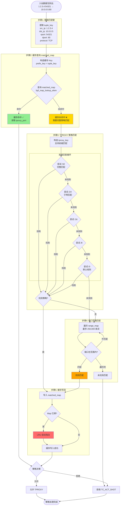
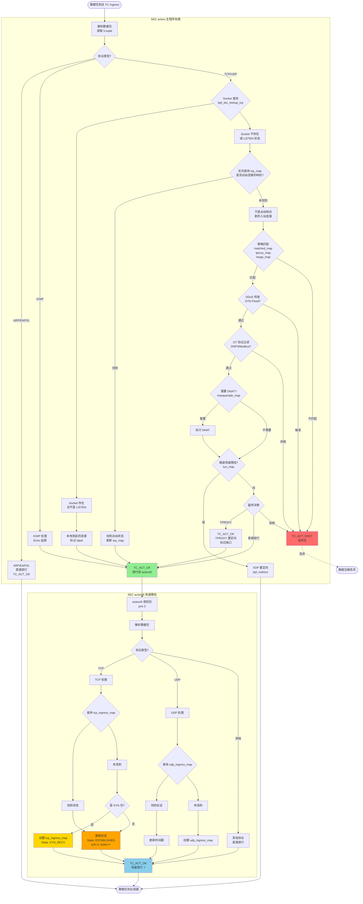
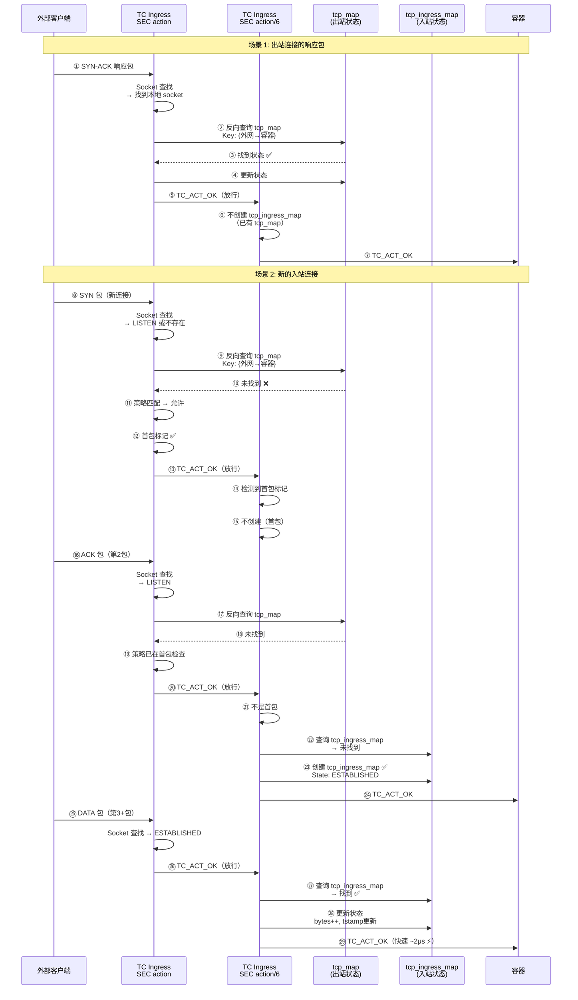
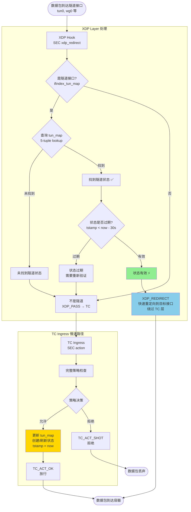
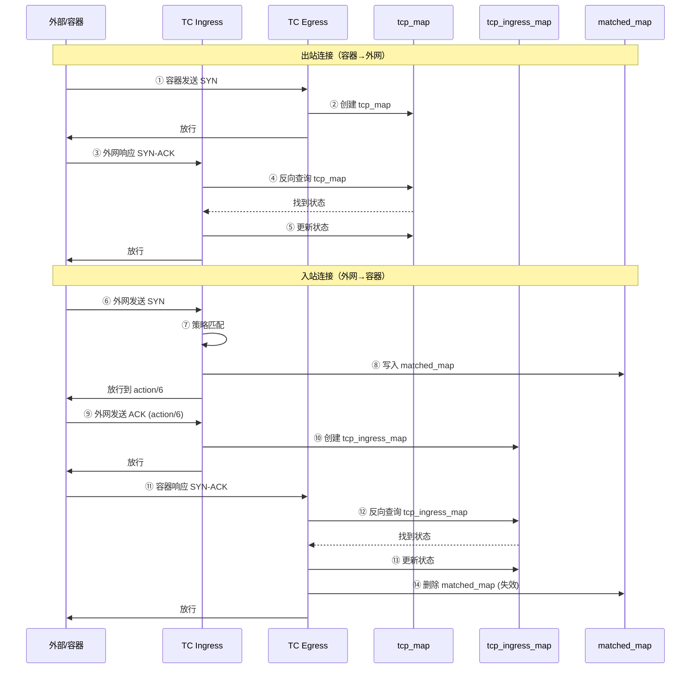

# ZFW 关键技术图表集

> **文档目的**: 通过详细的技术图表深入理解 ZFW 的核心实现机制
>
> **创建日期**: 2025-10-31
>
> **说明**: 本文档包含 6 个核心技术图表，每个图表都经过源码验证，准确反映 ZFW 的实际工作机制。

## 目录

1. [完整数据包处理流程图](#1-完整数据包处理流程图) ⭐⭐⭐⭐⭐
2. [策略匹配和缓存流程图](#2-策略匹配和缓存流程图) ⭐⭐⭐⭐⭐
3. [TPROXY 决策树和 action/6 调用时机](#3-tproxy-决策树和-action6-调用时机) ⭐⭐⭐⭐⭐
4. [Masquerade 完整流程（含端口分配）](#4-masquerade-完整流程含端口分配) ⭐⭐⭐⭐
5. [隧道快速路径优化](#5-隧道快速路径优化) ⭐⭐⭐
6. [Map 操作和数据流关系增强图](#6-map-操作和数据流关系增强图) ⭐⭐⭐⭐

---

## 1. 完整数据包处理流程图

> **📌 目的**: 理解数据包如何在不同 eBPF hook 点流转，以及 tcp_map 和 tcp_ingress_map 的创建和查询时机

### 1.1 出站连接完整流程（容器 → 外网）

```mermaid
flowchart TB
    Start([容器发送数据包<br/>10.0.0.5:12345 → 8.8.8.8:53])

    subgraph "步骤1: TC Egress 处理"
        EgressEntry[进入 TC Egress<br/>SEC action]
        EgressParse[解析数据包<br/>提取 5-tuple]
        EgressCheckSYN{是否是 SYN 包?}
        EgressCreateState[创建 tcp_map 条目<br/>Key: 10.0.0.5:12345→8.8.8.8:53<br/>State: SYN_SENT]
        EgressUpdateState[更新 tcp_map<br/>State: ESTABLISHED]
        EgressCheckMasq{需要 Masquerade?}
        EgressSNAT[SNAT 处理<br/>10.0.0.5 → 1.2.3.4<br/>更新 masquerade_map]
        EgressPass[TC_ACT_OK<br/>放行到网卡]
    end

    NetOut[数据包发送到网络<br/>1.2.3.4:12345 → 8.8.8.8:53]

    subgraph "步骤2: 外网服务器响应"
        ServerResp[服务器响应<br/>8.8.8.8:53 → 1.2.3.4:12345]
    end

    subgraph "步骤3: TC Ingress 处理响应"
        IngressEntry[进入 TC Ingress<br/>SEC action]
        IngressParse[解析数据包]
        IngressSocket{Socket 查找<br/>bpf_skc_lookup_tcp}
        IngressCheckMasq{需要 DNAT?}
        IngressDNAT[DNAT 处理<br/>1.2.3.4 → 10.0.0.5<br/>查询 masquerade_map]
        IngressReverseLookup[反向查询 tcp_map<br/>Key: 8.8.8.8:53→10.0.0.5:12345]
        IngressFound{找到状态?}
        IngressUpdate[更新状态<br/>State: ESTABLISHED<br/>ack=1, tstamp更新]
        IngressDrop[TC_ACT_SHOT<br/>丢弃包]
        IngressOK[TC_ACT_OK<br/>放行到容器]
    end

    End([数据包到达容器<br/>8.8.8.8:53 → 10.0.0.5:12345])

    Start --> EgressEntry
    EgressEntry --> EgressParse
    EgressParse --> EgressCheckSYN

    EgressCheckSYN -->|是 SYN| EgressCreateState
    EgressCheckSYN -->|不是| EgressUpdateState

    EgressCreateState --> EgressCheckMasq
    EgressUpdateState --> EgressCheckMasq

    EgressCheckMasq -->|是| EgressSNAT
    EgressCheckMasq -->|否| EgressPass
    EgressSNAT --> EgressPass

    EgressPass --> NetOut
    NetOut --> ServerResp
    ServerResp --> IngressEntry

    IngressEntry --> IngressParse
    IngressParse --> IngressSocket
    IngressSocket -->|找到本地 socket| IngressCheckMasq

    IngressCheckMasq -->|是| IngressDNAT
    IngressCheckMasq -->|否| IngressReverseLookup
    IngressDNAT --> IngressReverseLookup

    IngressReverseLookup --> IngressFound
    IngressFound -->|找到| IngressUpdate
    IngressFound -->|未找到| IngressDrop

    IngressUpdate --> IngressOK
    IngressOK --> End

    style EgressCreateState fill:#90EE90
    style IngressReverseLookup fill:#FFD700
    style IngressUpdate fill:#87CEEB
    style EgressSNAT fill:#FFA500
    style IngressDNAT fill:#FFA500
```



**关键点**:
- ✅ **Egress 创建 tcp_map**: 第一个 SYN 包时创建，Key 是正向的（容器→外网）
- ✅ **Ingress 反向查询**: 响应包到达时，用反向 Key（外网→容器）查询 tcp_map
- ✅ **Masquerade**: Egress 做 SNAT，Ingress 做 DNAT
- ✅ **状态同步**: Egress 创建，Ingress 更新

**源码位置**:
- Egress 创建: `zfw_tc_outbound_track.c:2833` - `insert_tcp()`
- Ingress 查询: `zfw_tc_ingress.c:2300-2353` - 反向 key 查询

---

### 1.2 入站连接完整流程（外网 → 容器）

```mermaid
flowchart TB
    Start([外部客户端发送<br/>1.2.3.4:54321 → 10.0.0.5:80])

    subgraph "步骤1: TC Ingress action 处理首包 SYN"
        ActionEntry[进入 TC Ingress<br/>SEC action 主程序]
        ActionParse[解析数据包<br/>提取 5-tuple]
        ActionSocket{Socket 查找<br/>bpf_skc_lookup_tcp}
        ActionPolicy{策略匹配<br/>tproxy_map + range_map}
        ActionDDoS{DDoS 检查<br/>SYN Flood?}
        ActionOT{OT 协议过滤<br/>DNP3/Modbus?}
        ActionDecision{策略决策}
        ActionDeny[TC_ACT_SHOT<br/>丢弃]
        ActionOK[TC_ACT_OK<br/>放行到 action/6<br/>✅ 首包耗时 ~15μs]
    end

    subgraph "步骤2: TC Ingress action/6 处理后续包"
        A6Entry[进入 TC Ingress<br/>SEC action/6 快速路径]
        A6Parse[解析数据包]
        A6CheckSYN{是否是 SYN?}
        A6Lookup[查询 tcp_ingress_map<br/>Key: 1.2.3.4:54321→10.0.0.5:80]
        A6Found{找到状态?}
        A6Create[创建 tcp_ingress_map<br/>State: ESTABLISHED]
        A6Update[更新状态<br/>ack=1, bytes计数<br/>tstamp更新]
        A6FastOK[TC_ACT_OK<br/>快速放行<br/>⚡ 后续包耗时 ~2μs]
    end

    Container[数据包到达容器<br/>10.0.0.5:80]

    subgraph "步骤3: 容器响应 - TC Egress"
        EgressEntry[进入 TC Egress<br/>SEC action]
        EgressParse[解析响应包]
        EgressReverse[反向查询 tcp_ingress_map<br/>Key: 10.0.0.5:80→1.2.3.4:54321]
        EgressFoundIn{找到状态?}
        EgressUpdateIn[更新 tcp_ingress_map<br/>响应包计数]
        EgressCheckOut[检查 tcp_map<br/>是否出站连接?]
        EgressPass[TC_ACT_OK<br/>放行响应包]
    end

    End([响应发送到外部<br/>10.0.0.5:80 → 1.2.3.4:54321])

    Start --> ActionEntry
    ActionEntry --> ActionParse
    ActionParse --> ActionSocket

    ActionSocket -->|不存在/LISTEN| ActionPolicy
    ActionPolicy -->|策略匹配| ActionDDoS
    ActionDDoS -->|通过| ActionOT
    ActionOT -->|通过| ActionDecision

    ActionDecision -->|允许| ActionOK
    ActionDecision -->|拒绝| ActionDeny

    ActionOK --> A6Entry
    A6Entry --> A6Parse
    A6Parse --> A6CheckSYN

    A6CheckSYN -->|不是 SYN| A6Lookup
    A6CheckSYN -->|是 SYN| A6Lookup

    A6Lookup --> A6Found
    A6Found -->|未找到 且 ACK| A6Create
    A6Found -->|找到| A6Update

    A6Create --> A6FastOK
    A6Update --> A6FastOK
    A6FastOK --> Container

    Container --> EgressEntry
    EgressEntry --> EgressParse
    EgressParse --> EgressReverse
    EgressReverse --> EgressFoundIn

    EgressFoundIn -->|找到| EgressUpdateIn
    EgressFoundIn -->|未找到| EgressCheckOut

    EgressUpdateIn --> EgressPass
    EgressCheckOut --> EgressPass
    EgressPass --> End

    style ActionPolicy fill:#FFD700
    style ActionDDoS fill:#FF6B6B
    style A6Create fill:#90EE90
    style A6FastOK fill:#87CEEB
    style EgressReverse fill:#FFA500
```



**关键点**:
- ✅ **首包走 action**: 完整策略检查（~15μs）
- ✅ **后续包走 action/6**: 快速路径（~2μs），性能提升 87%
- ✅ **action/6 创建 tcp_ingress_map**: 第二个包（ACK）时创建
- ✅ **Egress 反向查询**: 响应包用反向 Key 查询 tcp_ingress_map
- ✅ **双程序协作**: action (prio 1) → action/6 (prio 2)

**源码位置**:
- action 主程序: `zfw_tc_ingress.c:1280`
- action/6 程序: `zfw_tc_ingress.c:3987`
- action/6 创建状态: `zfw_tc_ingress.c:4105` - `insert_ingress_tcp()`
- Egress 反向查询: `zfw_tc_outbound_track.c:1264-1575`

---

### 1.3 双向流程对比总结

| 特性 | 出站连接（容器→外网） | 入站连接（外网→容器） |
|------|---------------------|---------------------|
| **首包处理** | TC Egress | TC Ingress action |
| **状态 Map** | tcp_map | tcp_ingress_map |
| **创建时机** | Egress 收到 SYN | action/6 收到 ACK（第2包） |
| **创建者** | TC Egress SEC("action") | TC Ingress SEC("action/6") |
| **响应处理** | TC Ingress action | TC Egress SEC("action") |
| **响应查询** | 反向查询 tcp_map | 反向查询 tcp_ingress_map |
| **首包延迟** | ~10μs (Egress 简单) | ~15μs (策略检查) |
| **后续包延迟** | ~5μs (Ingress 反向查询) | ~2μs (action/6 快速路径) ⚡ |
| **优化策略** | NAT 加速 | action/6 快速路径 |

**性能关键**:
- 入站连接通过 action/6 快速路径，后续包延迟降低 **87%** (15μs → 2μs)
- 出站连接无需快速路径，因为 Egress 处理本就简单（~10μs）

---


## 2. 策略匹配和缓存流程图

> **📌 目的**: 理解 ZFW 如何高效地进行策略匹配，以及 matched_map 缓存如何提升性能

### 2.1 完整策略匹配流程



**关键点**:
- ✅ **缓存优先**: 先查询 matched_map，命中则跳过复杂匹配（节省 ~90% 时间）
- ✅ **前缀匹配**: tproxy_map 支持 CIDR 前缀匹配（/32 → /24 → /16 → /8 → /0）
- ✅ **端口范围**: range_map 支持端口范围匹配（最多 250,000 条目）
- ✅ **LRU 淘汰**: matched_map 满时自动淘汰最久未使用的条目

**源码位置**:
- matched_map 查询: `zfw_tc_ingress.c:~1800`
- tproxy_map 匹配: `zfw_tc_ingress.c:~1850`
- range_map 匹配: `zfw_tc_ingress.c:~1900`
- 缓存清理: `zfw_tc_outbound_track.c:1488`

---


## 3. TPROXY 决策树和 action/6 调用时机

> **📌 目的**: 理解什么时候走 action 主程序，什么时候走 action/6 快速路径，以及 TPROXY 的决策逻辑

### 3.1 TC Ingress 完整决策树



**关键决策点**:
1. **Socket 查找**: 判断是本地连接 / 出站响应 / 新入站连接
2. **策略匹配**: 决定允许还是拒绝
3. **DDoS 检查**: SYN Flood 防护
4. **OT 过滤**: 工控协议深度检测
5. **TPROXY 决策**: 是否需要透明代理

**action vs action/6**:
- **action**: 处理首包，完整策略检查（~15μs）
- **action/6**: 处理后续包，仅状态追踪（~2μs）
- **协作方式**: action 返回 TC_ACT_OK → action/6 继续处理

---

### 3.2 关键判断：何时创建 tcp_ingress_map



**创建时机总结**:
- ✅ **tcp_ingress_map 创建**: action/6 收到入站连接的第 2 个包（ACK）时
- ❌ **不创建的情况**: 
  - 首包（SYN）: action 处理，action/6 不创建
  - 出站响应: 已有 tcp_map，无需 tcp_ingress_map
- ✅ **更新**: 第 3+ 包，action/6 更新 tcp_ingress_map

---

### 3.3 Socket 查找决策表

| Socket 查找结果 | 连接类型 | tcp_map 查询 | tcp_ingress_map 操作 | 后续处理 |
|----------------|---------|-------------|---------------------|---------|
| **存在且 ESTABLISHED** | 本地发起 | 不查询 | 不操作 | 直接放行 |
| **存在但 LISTEN** | 新入站连接 | 反向查询 | action/6 创建 | 策略检查 |
| **不存在** | 可能是响应 | 反向查询 | 视查询结果 | 策略检查或放行 |
| **反向查询命中** | 出站响应 | 更新 tcp_map | 不操作 | 放行 |
| **反向查询未命中** | 新入站连接 | 不操作 | action/6 创建 | 策略检查 |

**源码位置**:
- Socket 查找: `zfw_tc_ingress.c:~2100` - `bpf_skc_lookup_tcp()`
- 反向查询 tcp_map: `zfw_tc_ingress.c:2300-2353`
- action/6 创建: `zfw_tc_ingress.c:4105` - `insert_ingress_tcp()`

---


## 4. Masquerade 完整流程（含端口分配）

> **📌 目的**: 理解 ZFW 如何实现 NAT/Masquerade，特别是端口随机化和冲突检测机制

### 4.1 SNAT (Egress) 完整流程

```mermaid
flowchart TB
    Start([容器发送数据包<br/>10.0.0.5:12345 → 8.8.8.8:53])
    
    EgressEntry[TC Egress 收到包]
    CheckMasq{Masquerade 已启用?<br/>且有本地 IP?}
    NoMasq[不需要 NAT<br/>直接放行]
    
    CheckReverse{查询 masquerade_reverse_map<br/>是否已有映射?}
    FoundReverse[找到已有映射<br/>使用已分配的端口]
    
    subgraph "端口分配流程"
        GenRandom[生成随机源端口<br/>new_sport = random 1024-65535]
        CheckCollision{查询 masquerade_map<br/>端口是否冲突?}
        Collision[端口冲突<br/>已被其他连接使用]
        NoCollision[端口可用 ✅]
        RetryCount{重试次数 < 10?}
        Failed[分配失败<br/>放弃 SNAT]
    end
    
    CreateMaps[创建双 Map 条目]
    
    subgraph "Map 条目创建"
        CreateMasq[masquerade_map<br/>Key: {ifindex, dst_ip, protocol, new_sport, dport}<br/>Value: {orig_src_ip, orig_sport}]
        CreateReverse[masquerade_reverse_map<br/>Key: {local_ip, dst_ip, protocol, orig_sport, dport}<br/>Value: {orig_src_ip, orig_sport}]
    end
    
    ModifyPacket[修改数据包]
    
    subgraph "包修改"
        ChangeSrcIP[源 IP: 10.0.0.5 → 1.2.3.4]
        ChangeSrcPort[源端口: 12345 → new_sport]
        RecalcL3[重算 IP 校验和]
        RecalcL4[重算 TCP/UDP 校验和]
    end
    
    Success[SNAT 完成<br/>1.2.3.4:new_sport → 8.8.8.8:53]
    End([数据包发送到网络])

    Start --> EgressEntry
    EgressEntry --> CheckMasq
    CheckMasq -->|否| NoMasq --> End
    CheckMasq -->|是| CheckReverse
    
    CheckReverse -->|找到| FoundReverse --> ModifyPacket
    CheckReverse -->|未找到| GenRandom
    
    GenRandom --> CheckCollision
    CheckCollision -->|冲突| Collision --> RetryCount
    CheckCollision -->|无冲突| NoCollision --> CreateMaps
    
    RetryCount -->|是| GenRandom
    RetryCount -->|否| Failed --> NoMasq
    
    CreateMaps --> CreateMasq
    CreateMaps --> CreateReverse
    CreateReverse --> ModifyPacket
    
    ModifyPacket --> ChangeSrcIP --> ChangeSrcPort
    ChangeSrcPort --> RecalcL3 --> RecalcL4
    RecalcL4 --> Success --> End

    style GenRandom fill:#FFD700
    style Collision fill:#FF6B6B
    style NoCollision fill:#90EE90
    style CreateMaps fill:#87CEEB
```

**端口分配算法**:
```c
// zfw_tc_outbound_track.c:2705-2816
for (int i = 0; i < 10; i++) {
    new_sport = bpf_get_prandom_u32() % (65535 - 1024) + 1024;  // 1024-65535
    
    masq_key = {ifindex, dst_ip, protocol, new_sport, dport};
    if (!bpf_map_lookup_elem(&masquerade_map, &masq_key)) {
        // 端口可用，跳出循环
        break;
    }
    // 端口冲突，重试
}
```

**关键点**:
- ✅ **随机端口**: 1024-65535 范围内随机选择
- ✅ **冲突检测**: 最多重试 10 次
- ✅ **双 Map**: masquerade_map（正向）+ masquerade_reverse_map（反向）
- ✅ **校验和重算**: IP 层和传输层校验和都需要重新计算

---

### 4.2 DNAT (Ingress) 完整流程

```mermaid
flowchart TB
    Start([响应包到达<br/>8.8.8.8:53 → 1.2.3.4:12345])
    
    IngressEntry[TC Ingress 收到响应]
    CheckDst{目标 IP 是本地 IP?<br/>1.2.3.4 == local_ip}
    NotLocal[不是本地 IP<br/>不需要 DNAT]
    
    LookupMasq{查询 masquerade_map<br/>Key: {ifindex, 8.8.8.8, TCP, 12345, 53}}
    NotFound[未找到映射<br/>可能不是 NAT 连接]
    Found[找到映射 ✅<br/>Value: {10.0.0.5, 原始端口}]
    
    RestorePacket[恢复原始地址]
    
    subgraph "包恢复"
        RestoreDstIP[目标 IP: 1.2.3.4 → 10.0.0.5]
        RestoreDstPort[目标端口: 12345 → 原始端口]
        RecalcL3[重算 IP 校验和]
        RecalcL4[重算 TCP/UDP 校验和]
    end
    
    CheckState{检查连接状态}
    
    subgraph "状态检查"
        TCPCheck{TCP FIN/RST?}
        UDPCheck{UDP 超时?}
        DeleteMaps[删除 Map 条目<br/>清理 masquerade_map<br/>+ masquerade_reverse_map]
        KeepMaps[保持 Map 条目]
    end
    
    Success[DNAT 完成<br/>8.8.8.8:53 → 10.0.0.5:原始端口]
    End([数据包到达容器])

    Start --> IngressEntry
    IngressEntry --> CheckDst
    CheckDst -->|否| NotLocal --> End
    CheckDst -->|是| LookupMasq
    
    LookupMasq -->|未找到| NotFound --> End
    LookupMasq -->|找到| Found --> RestorePacket
    
    RestorePacket --> RestoreDstIP --> RestoreDstPort
    RestoreDstPort --> RecalcL3 --> RecalcL4
    RecalcL3 --> CheckState
    
    CheckState --> TCPCheck
    CheckState --> UDPCheck
    
    TCPCheck -->|是| DeleteMaps --> Success
    TCPCheck -->|否| KeepMaps --> Success
    
    UDPCheck -->|是| DeleteMaps
    UDPCheck -->|否| KeepMaps
    
    Success --> End

    style Found fill:#90EE90
    style DeleteMaps fill:#FF6B6B
    style RestorePacket fill:#87CEEB
```

**清理时机**:
- **TCP**: FIN 或 RST 包时删除映射
- **UDP**: 超时（通常 30 秒）后删除
- **ICMP**: Echo Reply 后立即删除

**源码位置**:
- SNAT: `zfw_tc_outbound_track.c:2705-2816`
- DNAT: `zfw_tc_ingress.c:1378-1444` (ICMP), `2520-2597` (UDP/TCP)
- 端口分配: `zfw_tc_outbound_track.c:2750-2780`
- Map 清理: `zfw_tc_ingress.c:1440`, `2590`

---


## 5. 隧道快速路径优化

> **📌 目的**: 理解 ZFW 如何通过 XDP 和隧道状态缓存实现高性能包转发

### 5.1 隧道流量处理流程



**性能对比**:

| 路径 | 处理层 | 延迟 | 说明 |
|------|--------|------|------|
| **快速路径** | XDP only | ~1μs ⚡ | 命中 tun_map，直接 XDP_REDIRECT |
| **慢速路径** | XDP + TC | ~15μs | 未命中或过期，走完整策略检查 |
| **性能提升** | - | **93%** | 快速路径比慢速路径快 15 倍 |

**状态生命周期**:
```
首包:  XDP 未命中 → TC 策略检查 → 创建 tun_map (30秒有效期)
后续: XDP 命中 → 直接重定向 (1μs)
过期: 30秒无流量 → 状态过期 → 下次走慢速路径
```

**源码位置**:
- XDP 处理: `zfw_xdp_tun_ingress.c:~50-150`
- tun_map 查询: `zfw_xdp_tun_ingress.c:~100`
- TC 更新: `zfw_tc_ingress.c:2599-2623`

---

## 6. Map 操作和数据流关系增强图

> **📌 目的**: 全面理解所有 Map 之间的关系，以及不同 hook 点如何读写这些 Map

### 6.1 完整 Map 操作矩阵

```mermaid
graph TB
    subgraph "XDP Layer"
        XDP[XDP Hook]
    end
    
    subgraph "TC Ingress Layer"
        ING_ACT[TC Ingress<br/>SEC action]
        ING_A6[TC Ingress<br/>SEC action/6]
    end
    
    subgraph "TC Egress Layer"
        EG[TC Egress<br/>SEC action]
    end
    
    subgraph "策略 Maps"
        TPROXY[tproxy_map<br/>HASH 100]
        RANGE[range_map<br/>HASH 250K]
        MATCHED[matched_map<br/>LRU 65K]
    end
    
    subgraph "出站状态 Maps"
        TCP_OUT[tcp_map<br/>LRU 65K]
        UDP_OUT[udp_map<br/>LRU 65K]
    end
    
    subgraph "入站状态 Maps"
        TCP_IN[tcp_ingress_map<br/>LRU 65K]
        UDP_IN[udp_ingress_map<br/>LRU 65K]
    end
    
    subgraph "NAT Maps"
        MASQ[masquerade_map<br/>HASH 65K]
        MASQ_REV[masquerade_reverse_map<br/>HASH 65K]
    end
    
    subgraph "隧道 Maps"
        TUN[tun_map<br/>LRU 10K]
        IFINDEX[ifindex_tun_map<br/>HASH]
    end
    
    subgraph "其他 Maps"
        ICMP[icmp_echo_map<br/>LRU 65K]
        DDOS[ddos_*_map<br/>多个]
        DIAG[diag_map<br/>诊断]
        RB[rb_map<br/>Ring Buffer]
    end

    ING_ACT -->|读| TPROXY
    ING_ACT -->|读| RANGE
    ING_ACT -->|读写| MATCHED
    ING_ACT -->|反向读| TCP_OUT
    ING_ACT -->|反向读| UDP_OUT
    ING_ACT -->|读写| MASQ
    ING_ACT -->|读| MASQ_REV
    ING_ACT -->|读写| TUN
    ING_ACT -->|读写| ICMP
    ING_ACT -->|读写| DDOS
    ING_ACT -->|写| RB
    
    ING_A6 -->|创建+更新| TCP_IN
    ING_A6 -->|创建+更新| UDP_IN
    ING_A6 -->|写| RB
    
    EG -->|创建+更新| TCP_OUT
    EG -->|创建+更新| UDP_OUT
    EG -->|反向读| TCP_IN
    EG -->|反向读| UDP_IN
    EG -->|读写| MASQ
    EG -->|读写| MASQ_REV
    EG -->|删除| MATCHED
    EG -->|写| RB
    
    XDP -->|读| IFINDEX
    XDP -->|读写| TUN
    XDP -->|写| RB

    style TCP_OUT fill:#90EE90
    style TCP_IN fill:#FFD700
    style MATCHED fill:#87CEEB
    style TUN fill:#FFA500
```



**操作类型说明**:
- **读**: 查询 Map (bpf_map_lookup_elem)
- **写**: 插入/更新 Map (bpf_map_update_elem)
- **删除**: 删除条目 (bpf_map_delete_elem)
- **反向读**: 用反向 key 查询（src/dst 互换）
- **创建**: 首次插入新条目
- **更新**: 修改已有条目

---

### 6.2 数据流同步关系



**同步关系总结**:
1. **tcp_map ↔ TCP Ingress**: Egress 创建，Ingress 反向查询并更新
2. **tcp_ingress_map ↔ TCP Egress**: Ingress/action6 创建，Egress 反向查询并更新
3. **matched_map ↔ Egress**: Ingress 创建缓存，Egress 负责失效
4. **masquerade_map ↔ masquerade_reverse_map**: Egress 创建双向映射，Ingress 查询恢复

---

### 6.3 Map 容量和 LRU 策略

| Map 名称 | 类型 | 最大条目 | LRU? | 满时行为 |
|---------|------|---------|------|---------|
| **tcp_map** | LRU_HASH | 65,535 | ✅ | 自动淘汰最久未用 |
| **tcp_ingress_map** | LRU_HASH | 65,535 | ✅ | 自动淘汰最久未用 |
| **matched_map** | LRU_HASH | 65,536 | ✅ | 自动淘汰 + Egress 主动删除 |
| **tun_map** | LRU_HASH | 10,000 | ✅ | 自动淘汰 |
| **tproxy_map** | HASH | 100 | ❌ | 插入失败 |
| **range_map** | HASH | 250,000 | ❌ | 插入失败 |
| **masquerade_map** | HASH | 65,536 | ❌ | 插入失败 |

**LRU 优势**:
- ✅ 自动内存管理
- ✅ 热点数据保留
- ✅ 无需手动清理
- ❌ 可能误删活跃连接（如果超过容量）

**HASH 劣势**:
- ❌ 需要手动清理
- ✅ 不会误删条目
- ✅ 适合静态配置（策略）

---

## 📝 总结

### 图表使用指南

1. **完整数据包处理流程图** → 理解整体架构和数据流
2. **策略匹配和缓存流程图** → 优化策略匹配性能
3. **TPROXY 决策树** → 调试连接问题
4. **Masquerade 流程图** → 实现 NAT 功能
5. **隧道快速路径图** → 优化隧道性能
6. **Map 操作关系图** → 理解状态同步

### 关键技术要点

1. **双 Map 架构**: tcp_map (出站) + tcp_ingress_map (入站) 解决双向追踪
2. **快速路径**: action/6 跳过策略检查，延迟降低 87%
3. **缓存机制**: matched_map 避免重复策略匹配，性能提升 90%
4. **XDP 加速**: 隧道流量 XDP 直接重定向，延迟降低 93%
5. **端口随机化**: Masquerade 支持端口冲突检测和重试
6. **LRU 自动淘汰**: 状态 Map 无需手动清理

---

**文档完成日期**: 2025-10-31

**下一步建议**: 
- 结合源码验证这些流程图
- 参考这些图表设计你自己的 eBPF 项目
- 使用这些图表进行技术分享和文档编写

