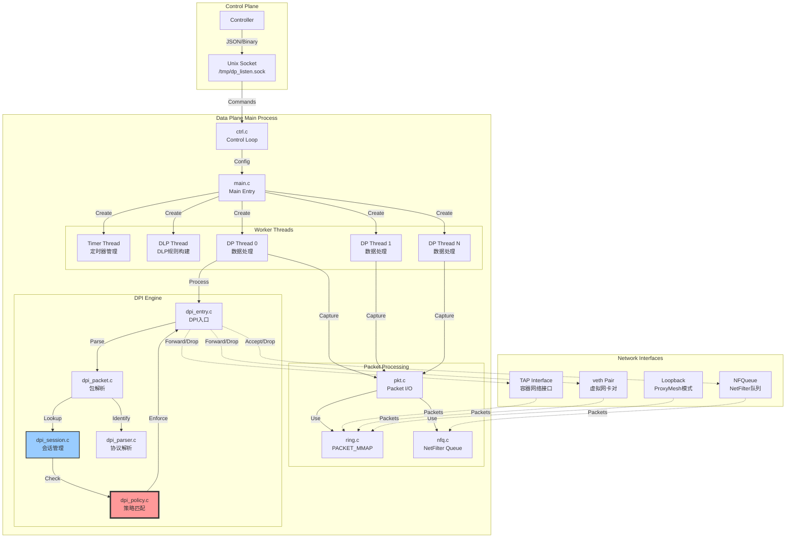
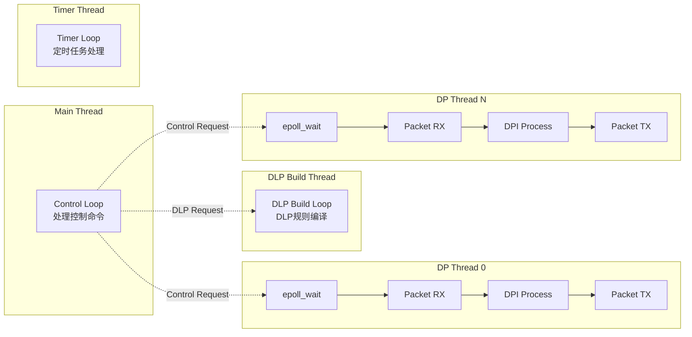
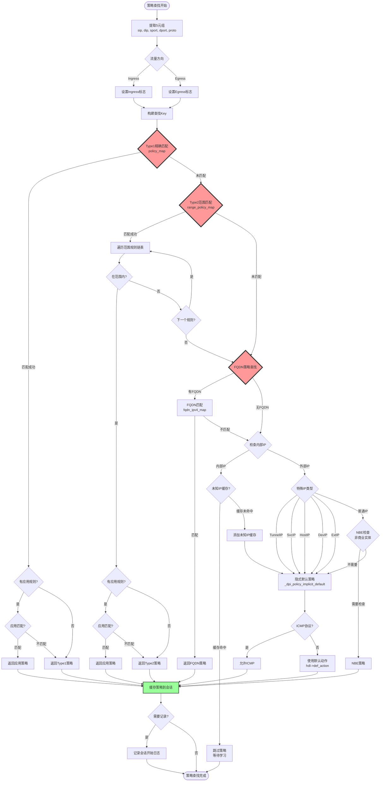
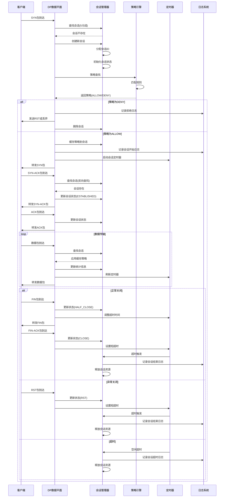

# DP (Data Plane) 微隔离系统设计文档

## 1. 系统概述

DP (Data Plane) 是一个基于用户态的高性能网络数据平面处理系统，专注于实现**微隔离（Microsegmentation）**功能。该系统通过深度包检测（DPI）、策略执行和会话管理来实现细粒度的网络访问控制。

### 1.1 核心功能

- **微隔离策略执行**：基于5元组（源IP、目的IP、源端口、目的端口、协议）+ 应用层协议的细粒度访问控制
- **深度包检测（DPI）**：支持多种应用层协议识别和检测
- **会话管理**：TCP/UDP/ICMP会话跟踪和状态管理
- **威胁检测**：DLP（数据泄露防护）、WAF（Web应用防火墙）
- **流量监控**：实时流量统计和会话日志

### 1.2 架构特点

- **多线程架构**：支持多个数据处理线程，充分利用多核CPU
- **零拷贝技术**：使用PACKET_MMAP实现高性能数据包捕获
- **RCU无锁设计**：使用RCU（Read-Copy-Update）机制实现高并发访问
- **多种部署模式**：支持TAP模式、TC模式、NFQ模式、ProxyMesh模式

---

## 2. 系统架构

### 2.1 整体架构图



### 2.2 线程模型



---

## 3. 微隔离核心流程

### 3.1 数据包处理完整流程

```mermaid
flowchart TD
    START([数据包到达]) --> CAPTURE[数据包捕获<br/>ring.c/nfq.c]
    CAPTURE --> EPOLL[epoll事件触发]
    EPOLL --> RX[dp_rx函数<br/>读取数据包]
    
    RX --> DPI_RECV[dpi_recv_packet<br/>DPI入口函数]
    
    DPI_RECV --> LOOKUP_EP{查找Endpoint<br/>根据MAC地址}
    LOOKUP_EP -->|未找到| CHECK_PROMISC{混杂模式?}
    CHECK_PROMISC -->|否| DROP1[丢弃数据包]
    CHECK_PROMISC -->|是| USE_DUMMY[使用虚拟EP]
    LOOKUP_EP -->|找到| PARSE_ETH
    USE_DUMMY --> PARSE_ETH
    
    PARSE_ETH[解析以太网帧<br/>dpi_parse_ethernet] --> CHECK_L2{L2层检查}
    CHECK_L2 -->|失败| DROP2[丢弃/重置]
    CHECK_L2 -->|通过| DETERMINE_DIR[确定流量方向<br/>Ingress/Egress]
    
    DETERMINE_DIR --> PARSE_IP[解析IP层<br/>IPv4/IPv6]
    PARSE_IP --> CHECK_FRAG{分片包?}
    CHECK_FRAG -->|是| FRAG_PROC[分片处理<br/>dpi_frag.c]
    CHECK_FRAG -->|否| PARSE_L4
    FRAG_PROC -->|重组完成| PARSE_L4
    FRAG_PROC -->|等待更多分片| CACHE_FRAG[缓存分片]
    
    PARSE_L4[解析L4层<br/>TCP/UDP/ICMP] --> INSPECT[dpi_inspect_ethernet<br/>深度检测]
    
    INSPECT --> LOOKUP_SESS{查找会话}
    LOOKUP_SESS -->|已存在| UPDATE_SESS[更新会话状态]
    LOOKUP_SESS -->|不存在| CREATE_SESS[创建新会话<br/>dpi_session_create]
    
    CREATE_SESS --> POLICY_LOOKUP[策略查找<br/>dpi_policy_lookup]
    UPDATE_SESS --> CHECK_POLICY{需要重新评估?}
    CHECK_POLICY -->|是| POLICY_LOOKUP
    CHECK_POLICY -->|否| APPLY_CACHED
    
    POLICY_LOOKUP --> MATCH_RULE{匹配规则}
    MATCH_RULE -->|精确匹配| EXACT_RULE[Type1规则匹配]
    MATCH_RULE -->|范围匹配| RANGE_RULE[Type2规则匹配]
    MATCH_RULE -->|FQDN匹配| FQDN_RULE[FQDN规则匹配]
    MATCH_RULE -->|无匹配| DEFAULT_POLICY[应用默认策略]
    
    EXACT_RULE --> CHECK_APP{需要应用检测?}
    RANGE_RULE --> CHECK_APP
    FQDN_RULE --> CHECK_APP
    DEFAULT_POLICY --> CHECK_APP
    
    CHECK_APP -->|是| APP_DETECT[应用协议检测<br/>dpi_parser]
    CHECK_APP -->|否| POLICY_ACTION
    APP_DETECT --> APP_MATCH{应用匹配?}
    APP_MATCH -->|匹配| APP_POLICY[应用层策略]
    APP_MATCH -->|不匹配| POLICY_ACTION
    APP_POLICY --> POLICY_ACTION
    
    APPLY_CACHED[应用缓存策略] --> POLICY_ACTION
    
    POLICY_ACTION{策略动作判断}
    POLICY_ACTION -->|ALLOW| DLP_CHECK{DLP检查?}
    POLICY_ACTION -->|DENY| LOG_DENY[记录拒绝日志]
    POLICY_ACTION -->|VIOLATE| LOG_VIOLATE[记录违规日志]
    POLICY_ACTION -->|DROP| DROP3[丢弃数据包]
    POLICY_ACTION -->|RESET| SEND_RST[发送RST]
    
    DLP_CHECK -->|需要| DLP_INSPECT[DLP内容检测]
    DLP_CHECK -->|不需要| WAF_CHECK
    DLP_INSPECT -->|违规| LOG_DLP[记录DLP日志]
    DLP_INSPECT -->|通过| WAF_CHECK
    LOG_DLP --> DROP4[丢弃数据包]
    
    WAF_CHECK{WAF检查?}
    WAF_CHECK -->|需要| WAF_INSPECT[WAF检测]
    WAF_CHECK -->|不需要| FORWARD
    WAF_INSPECT -->|攻击| LOG_WAF[记录WAF日志]
    WAF_INSPECT -->|通过| FORWARD
    LOG_WAF --> DROP5[丢弃数据包]
    
    LOG_DENY --> DROP3
    LOG_VIOLATE --> DROP3
    
    FORWARD[转发数据包] --> CHECK_MODE{工作模式}
    CHECK_MODE -->|TAP模式| FORWARD_TAP[直接转发]
    CHECK_MODE -->|TC模式| FORWARD_TC[TC转发]
    CHECK_MODE -->|NFQ模式| NFQ_ACCEPT[NF_ACCEPT]
    CHECK_MODE -->|非TC模式| FORWARD_PEER[转发到对端接口]
    
    FORWARD_TAP --> UPDATE_STATS[更新统计信息]
    FORWARD_TC --> UPDATE_STATS
    NFQ_ACCEPT --> UPDATE_STATS
    FORWARD_PEER --> UPDATE_STATS
    
    DROP3 --> UPDATE_STATS
    DROP4 --> UPDATE_STATS
    DROP5 --> UPDATE_STATS
    SEND_RST --> UPDATE_STATS
    
    UPDATE_STATS --> END([处理完成])
    
    style POLICY_LOOKUP fill:#ff9999,stroke:#333,stroke-width:4px
    style POLICY_ACTION fill:#ff9999,stroke:#333,stroke-width:4px
    style DLP_CHECK fill:#ffcc99,stroke:#333,stroke-width:2px
    style WAF_CHECK fill:#ffcc99,stroke:#333,stroke-width:2px
    style CREATE_SESS fill:#99ccff,stroke:#333,stroke-width:2px
```



### 3.2 策略匹配详细流程



### 3.3 会话管理流程



---

## 4. 微隔离关键数据结构

### 4.1 策略相关结构

```c
// 策略规则Key（5元组 + 应用）
typedef struct dpi_rule_key_ {
    uint32_t sip;        // 源IP地址
    uint32_t dip;        // 目的IP地址
    uint16_t dport;      // 目的端口
    uint16_t proto;      // 协议（TCP/UDP/ICMP）
    uint32_t app;        // 应用ID
} dpi_rule_key_t;

// 策略描述
typedef struct dpi_policy_desc_ {
    uint32_t id;         // 策略ID
    uint8_t action;      // 动作：ALLOW/DENY/VIOLATE
    uint16_t flags;      // 标志位
    uint16_t hdl_ver;    // 策略句柄版本
    uint32_t order;      // 优先级
} dpi_policy_desc_t;

// 策略句柄
typedef struct dpi_policy_hdl_ {
    uint16_t ref_cnt;              // 引用计数
    uint16_t ver;                  // 版本号
    rcu_map_t policy_map;          // Type1精确匹配规则
    rcu_map_t range_policy_map;    // Type2范围匹配规则
    int def_action;                // 默认动作
    int apply_dir;                 // 应用方向
    uint32_t flag;                 // 标志（如FQDN）
} dpi_policy_hdl_t;

// Endpoint结构
typedef struct io_ep_ {
    char iface[IFACE_NAME_LEN];    // 网络接口名
    struct io_mac_ *mac;            // MAC地址
    io_stats_t stats;               // 统计信息
    rcu_map_t app_map;              // 应用端口映射
    void *policy_hdl;               // 策略句柄
    uint16_t policy_ver;            // 策略版本
    rcu_map_t dlp_cfg_map;          // DLP配置
    rcu_map_t waf_cfg_map;          // WAF配置
    void *dlp_detector;             // DLP检测器
    bool tap;                       // TAP模式标志
} io_ep_t;
```

### 4.2 会话结构

```c
// 会话结构
typedef struct dpi_session_ {
    struct cds_lfht_node node;      // 哈希表节点
    timer_entry_t ts_entry;         // 定时器条目
    timer_entry_t tick_entry;       // Tick定时器
    
    uint64_t id;                    // 会话ID
    uint8_t ip_proto;               // IP协议
    uint32_t flags;                 // 会话标志
    
    dpi_wing_t client;              // 客户端信息
    dpi_wing_t server;              // 服务器端信息
    
    dpi_policy_desc_t policy_desc;  // 策略描述（缓存）
    dpi_policy_desc_t xff_desc;     // XFF策略描述
    
    uint16_t parser;                // 应用层解析器
    uint8_t severity;               // 威胁严重性
    uint8_t term_reason;            // 终止原因
    
    uint32_t last_report;           // 最后报告时间
    uint8_t tick_flags;             // Tick标志
} dpi_session_t;

// Wing结构（客户端/服务器端）
typedef struct dpi_wing_ {
    io_ip_t ip;                     // IP地址
    uint16_t port;                  // 端口
    uint8_t mac[ETH_ALEN];          // MAC地址
    
    uint64_t bytes;                 // 字节数
    uint64_t pkts;                  // 包数
    uint64_t reported_bytes;        // 已报告字节数
    uint64_t reported_pkts;         // 已报告包数
    
    uint32_t next_seq;              // TCP下一个序列号
    uint32_t tcp_acked;             // TCP已确认序列号
    uint16_t tcp_win;               // TCP窗口大小
    
    asm_cache_t asm_cache;          // 包重组缓存
} dpi_wing_t;
```

---

## 5. 部署模式详解

### 5.1 TAP模式（监控模式）

**工作原理**：
- DP进程监听容器的网络接口（通过network namespace）
- 只读取数据包进行分析，不修改流量
- 适用于可见性和审计场景

**配置示例**：
```json
{
    "command": "add_tap",
    "netns": "/proc/12345/ns/net",
    "iface": "eth0",
    "epmac": "02:42:ac:11:00:02"
}
```

### 5.2 TC模式（流量控制模式）

**工作原理**：
- 使用Linux TC（Traffic Control）钩子
- DP进程完全控制数据包的转发
- 可以丢弃、修改或重定向数据包
- 适用于强制执行微隔离策略

**配置示例**：
```json
{
    "command": "add_port_pair",
    "vin_iface": "veth-in",
    "vex_iface": "veth-ex",
    "epmac": "02:42:ac:11:00:02",
    "quar": false
}
```

### 5.3 NFQ模式（NetFilter Queue模式）

**工作原理**：
- 使用Linux NetFilter的NFQUEUE目标
- 数据包被内核转发到用户态DP进程
- DP进程返回NF_ACCEPT或NF_DROP判决
- 适用于Cilium等CNI集成

**配置示例**：
```json
{
    "command": "add_nfq",
    "netns": "/proc/12345/ns/net",
    "iface": "eth0",
    "qnum": 0,
    "epmac": "02:42:ac:11:00:02",
    "jumboframe": false
}
```

### 5.4 ProxyMesh模式（服务网格模式）

**工作原理**：
- 监听loopback接口
- 拦截Istio/Envoy等sidecar代理的流量
- 支持127.0.0.1地址的特殊处理
- 适用于服务网格环境

**特点**：
- 自动识别ProxyMesh MAC前缀（"lkst"）
- 特殊的流量方向判断逻辑
- 支持XFF（X-Forwarded-For）头部解析

---

## 6. 微隔离策略配置

### 6.1 策略类型

#### Type1 精确匹配规则
- **特点**：完全匹配5元组
- **存储**：哈希表（policy_map）
- **性能**：O(1)查找
- **适用场景**：精确的点对点访问控制

#### Type2 范围匹配规则
- **特点**：支持IP范围、端口范围、应用范围
- **存储**：哈希表 + 链表（range_policy_map）
- **性能**：O(n)遍历链表
- **适用场景**：网段级别的访问控制

#### FQDN规则
- **特点**：基于域名的访问控制
- **存储**：域名->IP映射表（fqdn_ipv4_map）
- **性能**：O(1)查找 + DNS解析
- **适用场景**：基于域名的外部访问控制

### 6.2 策略动作

```c
#define DP_POLICY_ACTION_OPEN          0  // 开放（学习模式）
#define DP_POLICY_ACTION_ALLOW         1  // 允许
#define DP_POLICY_ACTION_DENY          2  // 拒绝
#define DP_POLICY_ACTION_VIOLATE       3  // 违规（记录但允许）
#define DP_POLICY_ACTION_CHECK_APP     4  // 检查应用层
```

### 6.3 策略配置示例

```json
{
    "command": "set_policy",
    "macs": ["02:42:ac:11:00:02"],
    "def_action": 2,
    "apply_dir": 1,
    "rules": [
        {
            "id": 1001,
            "sip": "192.168.1.0",
            "sip_r": "192.168.1.255",
            "dip": "10.0.0.0",
            "dip_r": "10.0.0.255",
            "dport": 80,
            "dport_r": 80,
            "proto": 6,
            "action": 1,
            "ingress": true,
            "apps": [
                {
                    "rule_id": 1001,
                    "app": 1,
                    "action": 1
                }
            ]
        }
    ]
}
```

---

## 7. 性能优化技术

### 7.1 零拷贝技术

**PACKET_MMAP**：
- 使用mmap将内核缓冲区映射到用户态
- 避免数据包的内核-用户态拷贝
- 使用环形缓冲区批量处理数据包

```c
// ring.c中的实现
struct tpacket_req3 req3 = {
    .tp_block_size = BLOCK_SIZE,
    .tp_block_nr = BLOCK_NUM,
    .tp_frame_size = FRAME_SIZE,
    .tp_frame_nr = FRAME_NUM,
    .tp_retire_blk_tov = TIMEOUT,
    .tp_feature_req_word = TP_FT_REQ_FILL_RXHASH,
};
```

### 7.2 RCU无锁设计

**Read-Copy-Update**：
- 读操作无需加锁，性能极高
- 写操作通过复制-更新-替换完成
- 适用于读多写少的场景（如策略查找）

```c
// 策略查找示例
rcu_read_lock();
dpi_rule_t *rule = rcu_map_lookup(&hdl->policy_map, &key);
if (rule) {
    // 使用rule
}
rcu_read_unlock();
```

### 7.3 会话缓存

**策略缓存**：
- 首次查找后将策略缓存到会话结构
- 后续数据包直接使用缓存策略
- 避免重复的策略查找开销

**应用识别缓存**：
- 识别出应用协议后缓存到会话
- 后续数据包直接使用缓存的解析器
- 减少重复的协议识别开销

### 7.4 多线程并行处理

**线程模型**：
- 多个DP线程并行处理数据包
- 每个线程独立的会话表和定时器
- 避免线程间竞争和同步开销

**CPU亲和性**：
- 可配置线程数量（默认等于CPU核心数）
- 每个线程绑定到特定CPU核心
- 提高缓存命中率

---

## 8. 关键函数调用链

### 8.1 数据包接收链路

```
main()
  └─> net_run()
      └─> pthread_create(dp_data_thr)
          └─> dp_data_thr()
              └─> epoll_wait()
                  └─> dp_rx()
                      └─> dpi_recv_packet()
                          ├─> dpi_parse_ethernet()
                          └─> dpi_inspect_ethernet()
                              ├─> dpi_session_lookup()
                              ├─> dpi_session_create()
                              ├─> dpi_policy_lookup()
                              ├─> dpi_tcp_tracker()
                              ├─> dpi_process_detector()
                              └─> g_io_callback->send_packet()
```

### 8.2 策略配置链路

```
dp_ctrl_loop()
  └─> recvfrom()
      └─> dp_ctrl_handler()
          └─> dp_ctrl_set_policy()
              └─> dpi_policy_cfg()
                  ├─> dpi_policy_hdl_init()
                  ├─> dpi_rule_add()
                  │   ├─> dpi_rule_add_one()
                  │   └─> dpi_range_rule_add()
                  └─> ep->policy_hdl = hdl
```

### 8.3 会话管理链路

```
dpi_session_create()
  ├─> calloc(sizeof(dpi_session_t))
  ├─> session->id = ++th_counter.sess_id
  ├─> rcu_map_add(&th_session4_map, session)
  ├─> dpi_policy_lookup()
  ├─> dpi_session_start_log()
  └─> timer_wheel_entry_start(&session->ts_entry)

dpi_session_release()
  ├─> dpi_session_end_log()
  ├─> timer_wheel_entry_remove(&session->ts_entry)
  ├─> rcu_map_del(&th_session4_map, session)
  └─> free(session)
```

---

## 9. 监控和日志

### 9.1 统计信息

**Endpoint统计**：
- 入站/出站包数、字节数
- 当前会话数
- 应用协议分布

**会话统计**：
- TCP/UDP/ICMP会话数
- 当前活跃会话数
- 会话创建/销毁速率

**策略统计**：
- 规则匹配次数
- 拒绝/允许比例
- DLP/WAF检测次数

### 9.2 日志类型

**会话日志**：
- 会话开始/结束时间
- 5元组信息
- 字节数/包数统计
- 策略动作和ID

**威胁日志**：
- 威胁类型和ID
- 威胁严重性
- 触发规则
- 数据包详情

**违规日志**：
- 违规策略ID
- 违规原因
- 会话信息

---

## 10. 总结

### 10.1 微隔离核心优势

1. **细粒度控制**：基于5元组+应用层的精确访问控制
2. **高性能**：零拷贝、RCU无锁、多线程并行处理
3. **灵活部署**：支持多种部署模式（TAP/TC/NFQ/ProxyMesh）
4. **深度检测**：DPI引擎支持多种应用层协议识别
5. **实时监控**：完整的会话跟踪和统计信息

### 10.2 关键技术点

- **PACKET_MMAP**：零拷贝数据包捕获
- **RCU机制**：无锁并发访问
- **策略缓存**：会话级别的策略缓存
- **定时器轮**：高效的会话超时管理
- **多线程架构**：充分利用多核CPU

### 10.3 适用场景

- **容器微隔离**：Kubernetes/Docker容器间访问控制
- **服务网格安全**：Istio/Linkerd流量安全策略
- **零信任网络**：基于身份的细粒度访问控制
- **合规审计**：完整的流量日志和会话记录
- **威胁防护**：DLP、WAF、IDS/IPS功能

